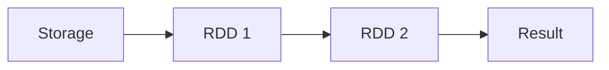

# Course Description
# Course Description
There's been a lot of buzz about Big Data over the past few years, and it's finally become mainstream for many companies. But what is this Big Data? This course covers the fundamentals of Big Data via PySpark. Spark is a "lightning fast cluster computing" framework for Big Data. It provides a general data processing platform engine and lets you run programs up to 100x faster in memory, or 10x faster on disk, than Hadoop. You’ll use PySpark, a Python package for Spark programming and its powerful, higher-level libraries such as SparkSQL, MLlib (for machine learning), etc. You will explore the works of William Shakespeare, analyze Fifa 2018 data and perform clustering on genomic datasets. At the end of this course, you will have gained an in-depth understanding of PySpark and its application to general Big Data analysis.

# Introduction to Big Data analysis with Spark 
this chapter introduces the exciting world of Big Data, as well as the various concepts and different frameworks for processing Big Data. You will understand why Apache Spark is considered the best framework for BigData. 

## Fundamentals of Big Data
Big data is a term to refer to the study and applications of data sets that are too complex for traditional data-processing software

The 3V's of Big Data:
- **Volume:** Size of the data
- **Variety:** Different sources and formats
- **Velocity:** Speed of the data

Concepts and Terminologies
- **Clustered computing:** Collection of resources of multiple machines
- **Parallel computing:** Simultaneous computation
- **Distributed computing:** Collection of nodes (networked computers) that run in parallel
- **Batch processing:** Breaking the job into small pieces and running them on individual machines
- **Real-time processing:** Immediate processing of data

Big data processing systems
- **Hadoop/MapReduce:** Scalable and fault tolerant framework written in Java
    - Open source and batch processing
- **Apacha Spark** General purpose and lightning fast cluster computing system
    - Open source and both batch and real-time data processing

Features of Apache Spark framework
- Distributed cluster computing framework
- Efficient in-memory computations for large data sets
- Lightning fast data processing framework
- Provides support for Java, Scala, Python, R and SQL.

Apache Spark Components:
- Spark SQL
- MLlib
- GraphX
- Spark Streaming
- Resilient Distributed Datasets (RDD) API (Apache Spark Core)
- *Note: RDDs in PySpark are a collection of partitions.*

Spark modes of deployment
- **Local mode:** Single machine, such as your laptop
    - Local model convenient for testing, debugging and demonstration
- **Cluster mode:** Set of pre-defined machines
    - Good for production
- Workflow: Local -> clusters
- No code change necessary

Pyspark: Spark with Python
- To support Python with Spark, Apache Spark Community released Pyspark
- Similar computation speed and power as Scala
- Pyspark APIs are similar to pandas and scikit-learn

Spark shell
- Interactive environment for running Spark jobs
- Helpful for fast interactive prototyping
- Spark's shells allow interacting with data on disk or in memory
- Three different Spark shells:
    - Spark-shell for Scala
    - Pyspark-shell for Python
    - SparkR for R

PySpark shell
- is the Python-based command line tool
- allows data scientists interface with Spark data structures
- support connecting to a cluster

Understanding SparkContext
- Spark Context is an entry of point into the world of Spark
- An entry point is where control is transferred from the OS to the provided program
- An entry of point is a way of connecting to Spark cluster
- An entry of point is like a key to the house
- Pyspark has a default SparkContext called sc

Inspecting SparkContext
```Python
# Print the version of SparkContext
print("The version of Spark Context in the PySpark shell is", sc.version)

# Print the Python version of SparkContext
print("The Python version of Spark Context in the PySpark shell is", sc.pythonVer)

# Print the master of SparkContext
print("The master of Spark Context in the PySpark shell is", sc.master)
```

Loading data in Pyspark

In PySpark, we express our computation through operations on distributed collections that are automatically parallelized across the cluster.

In the code below, you'll load the data from a local file in PySpark shell. 

```python
# SparkContext's parallelize() method
rdd = sc.parallelize([1,2,3,4,5])

# SparkContext's textFile() method
rdd2 = sc.textFile("text.txt")
```
What are anonymous functions in Python?
- Lambda functions are anonymous functions in Python
- Very powerful and used in Python. Quite efficient with ```map()``` and ```filter```()
- Lambda functions create functions to be called later similar to ```def```
- It returns the functions instead of assigning it to a namew. It returns functions without any name (i.e. anonymous)
- In practice, they are used as a way to inline a function definition or to defer execution of a code

Lambda function syntax
```python
# The general form of lambda function
lambda arguments: expression

# Example of lambda function
double = lambda x: x * 2
```

Difference between def vs lambda functions
- No return statement for lambda
- Can put lambda function anywhere
- Lambda function doesn't need to assign it to a variable, unlike def

```python
def cube(x):
    return x ** 3
g = lambda x: x ** 3
print(cube(10))
print(g(10))
```

Map() - Use of Lambda function in Python
- map() function takes a function and a list and returns a new list which contains items returned by that function for each item
```python
# General syntax of map()
map(function, list)

# Example of map()
items = [1,2,3,4]
list(map(lambda x: x + 3, items))
```

Filter() - Use of Lambda function in Python
- filter() function takes a function and a list and returns a new list for which the function evaluates as true

```python
# General syntax of filter()
filter(function, list)

# Example of filter()
items = [1,2,3,4]
list(filter(lambda x: x%2 != 0, items))
```

# Programming in PySpark RDD’s 
Chapter description: The main abstraction Spark provides is a resilient distributed dataset (RDD), which is the fundamental and backbone data type of this engine. This chapter introduces RDDs and shows how RDDs can be created and executed using RDD Transformations and Actions. 

RDDs
- resilient distributed dataset
- It is an immutable collection of data distributed across the cluster
- Spark's core abstraction for working with data
- Resilient: the ability to withstand failures and recompute missing or damaged partitions 
- Distributed: spanning the jobs across multiple nodes in the cluster (for efficient computation)
- Datasets: a collection of partitioned data

When Spark starts processing data, it divides the data into partitions and distributes the data across cluster nodes, with each node containing a slice of data.

How to create RDDs
- Parallelizing an existing collection of objects
    - RDDs are created from a list or a set using SparkContext's parallelize method (parallelize())
- External datasets
    - A more common way to do it is to load data from external datasets such as files stored in HDFS or objects in buckets
    - textFile() for creating RDDs from external datasets
    - lines in a text file:
- From existing RDDs

```python
# RDD created from a Python list
num_RDD = sc.parallelize([1,2,3,4])

# RDD created from a Python string
str_RDD = sc.parallelize("This is a string")

# RDD created using textFile method
file_RDD = sc.textFile("README.md")

# getNumPartitions()
file_RDD.getNumPartitions()
```

Partitions
- A partition is a logical division of a large distributed data set

## Spark Operation
Pyspark supports two different tyepes of operations:
- Transformations (create new RDDs)
- Actions (perform computation on the RDD)

Basic RDD Transformations
- map(): applies a function to all elements in the RDD
- filter() returns a new RDD with only the elements that pass the confition
- flatMap() returns multiple values for each element in the original RDD
- union() union two or more RDDs

```python
# map() Transformation
RDD = sc.parallelize([1,2,3,4])
RDD_map = RDD.map(lambda x: x * x)

# filter() Transformation
RDD = sc.parallelize([1,2,3,4])
RDD_filter = RDD.filter(lambda x: x > 2)

# flatMap() Transformation
RDD = sc.parallelize(["hello world", "how are you"])
RDD_flatmap = RDD.flatMap(lambda x: x.split(" "))

# union() Transformation
inputRDD = sc.textFile("logs.txt")
errorRDD = inputRDD.filter(lambda x: "error" in x.split())
warningsRDD = inputRDD.filter(lambda x: "warnings" in x.split())
combinedRDD = errorRDD.union(warningsRDD)
```



RDD Actions
Actions are the operations that are applied on RDDs to return a value after running a computation
- Operator return a vale after running a computation
- Basic RDD Actions
    - collect(): returns all the elements of the dataset as an array
    - take(N): returns an array with the first N elements of the dataset
    - first(): print the first element of the RDD
    - count(): return the number of elements in the RDD

## Working with Pair RDDs in Pyspark
Introduction to pair RDDs in Pyspark:
- Real life datasets are usually key/value pairs
- Each row is a key and maps to one or more values
- **Pair RDD is a special data structure to work with this kind of datasets**
- Pair RDD: Key is the identifier and value is data

Two common ways to create pair RDDs
1. From a list of key-value tuple
1. From a regular RDD (Array)

```python
# Get the data into key/value form for paired RDD
my_tuple = [('Leo', 29), ('Ananda', 27), ('Mauricio', 53), ('Rosa', 59)]
pairRDD_tuple = sc.parallelize(my_tuple)

my_list = ['Leo 29', 'Ananda 27', 'Mauricio 53', 'Rosa 59']
regularRDD = sc.parallelize(my_list)
PairRDD_RDD = regularRDD.map(lambda s: (s.split(' ')[0], s.split(' ')[1]))
```
Transformations on pair RDDs
- All regular transformations work on pair RDD
- Have to **pass** functions that operate on **key value pairs** rather than on individual elements
- Examples of paired RDD Transformations
  - reduceByKey(func): Combine values with the same key
  - groupByKey(): Group values with the same key
  - sortByKey(): Return an RDD sorted by the key
  - join(): Join two pair RDDs based on their key

reduceByKey()
- it combines values with the same key
- It runs parallel operations for each key in the dataset
- In other words, operates on key, value (k,v) pairs and merges the values for each key.
- It is a transformation and not action

sortByKey()
- it orders pair RDD by key
- it returns and RDD sorted by key in ascending or descending order

groupByKey()
- groups all the values with the same key in the pair RDD

join()
- it joins the two pair RDDs based on their key

```python
# reduceByKey() example
regularRDD = sc.parallelize([("Messi", 23), ("Ronaldo", 34),
("Neymar", 22), ("Messi", 24)])
pairRDD_reducebykey = regularRDD.reduceByKey(lambda x,y : x + y)
pairRDD_reducebykey.collect()

output: [('Neymar', 22), ('Ronaldo', 34), ('Messi', 47)]

# sortByKey() example
pairRDD_reducebykey_rev = pairRDD_reducebykey.map(lambda x: (x[1], x[0]))
pairRDD_reducebykey_rev.sortByKey(ascending=False).collect()

output: [(47, 'Messi'), (34, 'Ronaldo'), (22, 'Neymar')]

# groupByKey() example
airports = [("US", "JFK"),("UK", "LHR"),("FR", "CDG"),("US", "SFO")]
regularRDD = sc.parallelize(airports)
pairRDD_group = regularRDD.groupByKey().collect()
for cont, air in pairRDD_group:
print(cont, list(air))

output:
FR ['CDG']
US ['JFK', 'SFO']
UK ['LHR']

# join() example
RDD1 = sc.parallelize([("Messi", 34),("Ronaldo", 32),("Neymar", 24)])
RDD2 = sc.parallelize([("Ronaldo", 80),("Neymar", 120),("Messi", 100)])
RDD1.join(RDD2).collect()

output: 
[('Neymar', (24, 120)), ('Ronaldo', (32, 80)), ('Messi', (34, 100))]
```
## More actions
reduce()
- reduce(func) action is used for aggregating the elements of a regular RDD
- THe function should be commutative (changing the order of the operands does not change the result) and associative

saveAsTextFile()
- It saves RDD into a text file inside a directory with each partition as a separate file

coalesce()
- it is used to save RDD as a single text file
- returns a new RDD that is reduced into a single partition

countByKey() action
- it is only available for type (k,v)
- it counts the number of elements for each key

collectASMap()
- It returns key key-value pairs in the RDD as a dictionary

```python
# reduce example: calculates the sum of all the elements in an RDD
x = [1,3,4,6]
RDD = sc.parallelize(x)
RDD.reduce(lambda x, y: x + y)
output: 14

# saveAsTextFile() example
RDD.saveAsTextFile("tempFile")

# coalesce() example
RDD.coalesce(1).saveAsTextFile("tempFile")

# countByKey example
rdd = sc.parallelize([("a", 1), ("b", 1), ("a", 1)])
for key, val in rdd.countByKey().items():
print(key, val)

output: 
('a', 2)
('b', 1)

# collectAsMap() example
sc.parallelize([(1, 2), (3, 4)]).collectAsMap()

output: {1: 2, 3: 4}
```

# PySpark SQL & DataFrames
In this chapter, you'll learn about Spark SQL which is a Spark module for structured data processing. It provides a programming abstraction called DataFrames and can also act as a distributed SQL query engine. This chapter shows how Spark SQL allows you to use DataFrames in Python. 

# Machine Learning with PySpark MLlib 
PySpark MLlib is the Apache Spark scalable machine learning library in Python consisting of common learning algorithms and utilities. Throughout this last chapter, you'll learn important Machine Learning algorithms. You will build a movie recommendation engine and a spam filter, and use k-means clustering. 