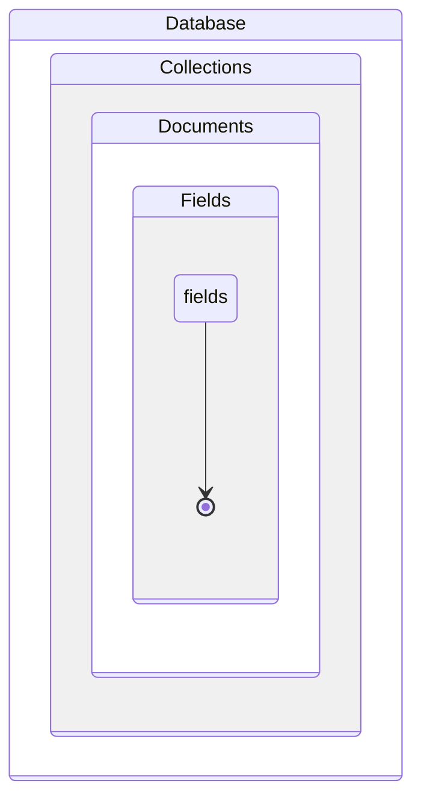

# Course Description
MongoDB is a tool to explore data structured as you see fit. As a NoSQL database, it doesn't follow the strict relational format imposed by SQL. By providing capabilities that typically require adding layers to SQL, it collapses complexity. With dynamic schema, you can handle vastly different data together and consolidate analytics. The flexibility of MongoDB empowers you to keep improving and fix issues as your requirements evolve. In this course, you will learn the MongoDB language and apply it to search and analytics. Working with unprocessed data from the official nobelprize.org API, you will explore and answer questions about Nobel Laureates and prizes.

# Flexibly Structured Data
This chapter is about getting a bird's-eye view of the Nobel Prize data's structure. You will relate MongoDB documents, collections, and databases to JSON and Python types. You'll then use filters, operators, and dot notation to explore substructure. 

MongoDB is a tool that helps you explore data without requiring it to have a strict, known structure. Because of this, it is possible to handle diverse data together and unify analytics.


Javascript is the language of web browsers. 
- It is a common way that web services and client code pass data.
- Objects map string keys to values, and arrays order values.
- Values are strings, numbers, the value "true, false, null" or another object or array

JSON data types have equivalents in Python, as shows the table below:

| **JSON**    | **Python**          |
|-------------|---------------------|
| Objects     | Dictionaries (dict) |
| Arrays      | Lists (list)        |
| **Values:** |                     |
| strings     | str                 |
| _numbers_   | int, float          |
| true/false  | True/ False         |
| null        | None                |

MongoDB, JSON, and Python

- A **database** maps names to collections
- A **collection** is like a list of dictionaries, callled by **documents** by MongoDB
- When a dictionary is a value within a document, that's a **subdocument**

| **MongoDB**  | **JSON**    | **Python**                       |
|--------------|-------------|----------------------------------|
| Databases    | Objects     | Dictionaries                     |
| Collections  | Arrays      | Lists                            |
| Documents    | Objects     | Dictionaries                     |
| Subdocuments | Objects     | Dictionaries                     |
| Values       | Value types | Value types + datetime, regex... |



Dot notation
- query arrays and subdocuments
- It is how MongoDB allows us to query document substructured

Exists operator allows to query for the existence or non-existence of fields

```python
# The Nobel Prize API data (base)
import requests
from pymongo import MongoClient
# Client connects to "localhost" by default
client = MongoClient()
# Create local "nobel" database on the fly
db = client["nobel"]
for collection_name in ["prizes", "laureates"]:
# collect the data from the API
    response = requests.get(
        "http://api.nobelprize.org/v1/{}.json".\
        format(collection_name[:-1] ))
    # convert the data to json
    documents = response.json()[collection_name]
    # Create collections on the fly
    db[collection_name].insert_many(documents)


# Acessing databases and collections
# 1 - using []
# client is a dictionary of databases
db = client["nobel"]
# database is a dictionary of collections
prizes_collection = db["prizes"]

# 2 - using .
# databases are attributes of a client
db = client.nobel # Connect to the "nobel" database
# collections are attributes of databases
prizes_collection = db["prizes"]


# Count documents in a collection
# Use empty document {} as a filter
filter = {}
# Count documents in a collection
n_prizes = db.prizes.count_documents(filter)
n_laureates = db.laureates.count_documents(filter)

# Find one document to inspect
doc = db.prizes.find_one(filter)


# Listing databases and collections
# Save a list of names of the databases managed by client
db_names = client.list_database_names()
print(db_names)

# Save a list of names of the collections managed by the "nobel" database
nobel_coll_names = client.nobel.list_collection_names()
print(nobel_coll_names)

# Count documents by providing a filter document to match
filter_doc = {
'born': '1845-03-27',
'diedCountry': 'Germany',
'gender': 'male',
'surname': 'Röntgen'
}
db.laureates.count_documents(filter_doc)

# Query operators
    # value in a list
db.laureates.count_documents({
'diedCountry': {
'$in': ['France', 'USA']}})

    # not equal
db.laureates.count_documents({
'diedCountry': {
'$ne': 'France'}})

    # exists
db.laureates.count_documents({"prizes.1": {"$exists": True}})
```

# Working with Distinct Values and Sets
This chapter is about dipping your toes into the pools of values for various fields. You'll collect distinct values, test for membership in sets, and match values to patterns. 

Distinct()
- Collect distinct values of a certain field passed as argument

```python
# Distinct
db.laureates.distinct("prizes.category")

# Pre-filtering distinct values
db.laureates.distinct("prizes.category", {"prizes.share": '4'})
    # or 
db.laureates.count_documents({"prizes.1": {"$exists": True}})

# Matching array fields
db.laureates.count_documents({
    "prizes": {"$elemMatch":
        {"category": "physics", "share": "1"}}})

# Regex
case_sensitive = db.laureates.distinct(
    "bornCountry",
    {"bornCountry": {"$regex": "Poland"}})

# Flag options for regular expressions
case_insensitive = db.laureates.distinct(
    "bornCountry",
    {"bornCountry": {"$regex": "poland", "$options": "i"}})

# Regex beginning
from bson.regex import Regex

db.laureates.distinct("bornCountry",
    {"bornCountry": Regex("^Poland")})
```


# Get Only What You Need, and Fast 
You can now query collections with ease and collect documents to examine and analyze with Python. But this process is sometimes slow and onerous for large collections and documents. This chapter is about various ways to speed up and simplify that process. 

Projection:
- The term projection is about reducing multidimensional data
- We do this passing a dictionary as a second argument to the find method
- reducing data to fewer dimensions
- Projection as a dictionary:
    - Include fields: ```"field_name" : 1```
    - "_id" is included by default
    - list the fields: ```["field_name1, "field_name2"]```

```python
# include only prizes.addiliations and exclude _id
docs = db.laureates.find(
            filter={},
            projection={"prizes.affiliations": 1,
                "_id": 0})

# convert to list and slice
list(docs)[:3]

# only projected fields that exist are returned
docs = db.laureates.find({}, ["favoriteIceCreamFlavor"])

# Missing fields
docs = db.laureates.find(
    filter={"gender": "org"},
    projection=["bornCountry", "firstname"])

# Aggretation example
docs = db.laureates.find({}, ["prizes"])
n_prizes = 0
for doc in docs:
    # count the number of pizes in each doc
    n_prizes += len(doc["prizes"])
print(n_prizes)

# Same example above using comprehension
sum([len(doc["prizes"]) for doc in docs])
```

## Sorting
- It means sort the results on the server before they get returned to us
- The built-in Python ```sorted``` function sorts the documents in ascending order
```python
# Sorting post-query with Python
docs = list(db.prizes.find({"category": "physics"}, ["year"]))
docs_sorted = sorted(docs, key=itemgetter("year"), reverse=True)

# Sorting in-query with MongoDB
cursor = db.prizes.find({"category": "physics"}, ["year"],
    sort=[("year", 1)]) # ASC

cursor = db.prizes.find({"category": "physics"}, ["year"],
    sort=[("year", -1)]) #DESC

# Primary and secondary sorting
for doc in db.prizes.find(
    {"year": {"$gt": "1966", "$lt": "1970"}},
    ["category", "year"],
    sort=[("year", 1), ("category", -1)]):
        print("{year} {category}".format(**doc)
)
```

## Indexes
An index in MongoDB is like a book's index. 
E.g.:
1. I grab a text book. 
1. I want information about "something"
1. I could flip through the book but instead I go to the index
1. I see an alphabetical ordering of terms, with page numbers for each
1. I find the information that I want ("something"), which directs me to page X
1. Finally, I go there.

**With MongoDB, imagine each collection as a book, each document as a page, and each field as a type of content**


Indexes
- When to use:
    - Queries with high specificity
        - When it is expected to get only one or a few documents back
    - Large documents
    - Large collections

Gauging performance before indexing: Jupyter Notebok %%timeit magic (same as python -m timeit "expression")


Adding a single field index
- index model: list of (field, direction) pairs
- directions: 1 (ascending) and -1 (descending)

Adding a compound (multiple-field) index


```python
# Gauging performance
%%timeit
docs = list(db.prizes.find("year":"1901"))
    # output: 524 μs ± 7.34 μs per loop (mean ± std. dev. of 7 runs, 1000 loops each)

%%timeit
docs = list(db.prizes.find({}, sort=[("year", 1)]))
    # output: 5.18 ms ± 54.9 μs per loop (mean ± std. dev. of 7 runs, 100 loops each)

# Add a single-field index
db.prizes.create_index([("year", 1)])

# Compare with the previously results
%%timeit
docs = list(db.prizes.find("year":"1901"))
    # output: 379 μs ± 1.62 μs per loop (mean ± std. dev. of 7 runs, 1000 loops each)

%%timeit
docs = list(db.prizes.find({}, sort=[("year", 1)]))
    # output: 4.28 ms ± 95.7 μs per loop (mean ± std. dev. of 7 runs, 100 loops each)

# Add a compound (multiple-field) index
db.prizes.create_index([("category", 1), ("year", 1)])

%%timeit
db.prizes.find_one({"category": "economics"},
    {"year": 1, "_id": 0},
    sort=[("year", 1)])
# Before
673 μs ± 3.36 μs per loop
(mean ± std. dev. of 7 runs, 1000 loops each)
# After
407 μs ± 5.51 μs per loop
(mean ± std. dev. of 7 runs, 1000 loops each)

# Getting more information about index
db.laureates.index_information() # always an index on "_id" field
    # output: {'_id_': {'v': 2, 'key': [('_id', 1)], 'ns': 'nobel.laureates'}}
db.laureates.find( {"firstname": "Marie"}, {"bornCountry": 1, "_id": 0}).explain()
```

## Limits and Skips
Limits and skips help us ispect a few documents at a time and page through a collectionWhen you use the skip parameter in conjunction with limits you can get pagination, with the number of results per page set by the limit parameter.


```python
# limit
for doc in db.prizes.find({"laureates.share": "3"}. limit=3):
    print("{year} {category}".format(**doc) )

# Skip lines
for doc in db.prizes.find({"laureates.share": "3"}, skip=6, limit=3):
    print("{year} {category}".format(**doc))

# Using cursor for sort, skip, and limit
for doc in (db.prizes.find({"laureates.share": "3"})
    .sort([("year", 1)])
    .skip(3)
    .limit(3)):
        print("{year} {category}".format(**doc))

# Sorts of sort - Same result
cursor1 = (db.prizes.find({"laureates.share": "3"}).skip(3).limit(3).sort([("year", 1)]))
cursor2 = (db.prizes.find({"laureates.share": "3"}).skip(3).limit(3).sort("year", 1))
cursor3 = (db.prizes.find({"laureates.share": "3"}).skip(3).limit(3).sort("year"))
```

# Aggregation Pipelines: Let the Server Do It For You 
You've used projection, sorting, indexing, and limits to speed up data fetching. But there are still annoying performance bottlenecks in your analysis pipelines. You still need to fetch a ton of data. Thus, network bandwidth and downstream processing and memory capacity still impact performance. This chapter is about using MongoDB to perform aggregations for you on the server. 


Queries have implicit stages.

```python
# Code 1 Method 1 - Fetch data
cursor = db.laureates.find(
    filter={"bornCountry": "USA"},
    projection={"prizes.year": 1},
    limit=3
)

# Code 2 Method 2 - Fetch data
cursor = db.laureates.aggregate([
    {"$match": {"bornCountry": "USA"}},
    {"$project": {"prizes.year": 1}},
    {"$limit": 3}
])

# Code 3 Method 1 - Count
list(db.laureates.aggregate([
{"$match": {"bornCountry": "USA"}},
{"$count": "n_USA-born-laureates"}
]))

# Code 4 Method 2 - Count
db.laureates.count_documents({"bornCountry": "USA"})

```

The code 1 above has three stages:
2. The first stage filters for documents that match an expression
1. The second stage projects out fields I need downstream for ouput
1. The last stage limits the number of documents retrieved


With an aggregation pipeline, The stages will be explicit.

An aggregation pipeline is a list, a sequence of stages. Each stage involves a stage operator.

The Code 2 procuces the same result as the Code 1.


Aggregation stages can use expressions that contain field paths. An expression object has the form ```{field1:<expression>}```;

Expressions are used into a "project" stage object

It's possible to create new fields or overwrite old ones, during aggregation.

The expression applies the operator to one or more argumens and returns a value

```python
# project of a field called n_prizes
db.laureates.aggregate([
    {"$project": {"n_prizes": {"$size": "$prizes"}}}
    ]).next()
    # expression: {"$size": "$prizes"}
    # field: $prizes

# sizing
list(db.prizes.aggregate([
    {"$project": {"n_laureates": {"$size": "$laureates"},
        "year": 1, "category": 1, "_id": 0}}
]))

# Sizing and summing
list(db.prizes.aggregate([
    {"$project": {"n_laureates": {"$size": "$laureates"},
        "category": 1}},
    {"$group": {"_id": "$category", "n_laureates":
        {"$sum": "$n_laureates"}}},
    {"$sort": {"n_laureates": -1}},
]))

# $unwind
list(db.prizes.aggregate([
    {"$unwind": "$laureates"},
    {"$project": {
        "_id": 0, "year": 1, "category": 1,
        "laureates.surname": 1, "laureates.share": 1}},
    {"$limit": 3}
]))

# Renormalization
list(db.prizes.aggregate([
    {"$unwind": "$laureates"},
    {"$project": {"year": 1, "category": 1, "laureates.id": 1}},
    {"$group": {"_id": {"$concat": ["$category", ":", "$year"]},
        "laureate_ids": {"$addToSet": "$laureates.id"}}},
    {"$limit": 5}
]))

# Lookup
list(db.prizes.aggregate([
    {"$match": {"category": "economics"}},
    {"$unwind": "$laureates"},
    {"$lookup": {"from": "laureates", "foreignField": "id",
        "localField": "laureates.id", "as": "laureate_bios"}},
    {"$unwind": "$laureate_bios"},
    {"$group": {"_id": None,
        "bornCountries":
        {"$addToSet": "$laureate_bios.bornCountry"}
    }},
]))
```

