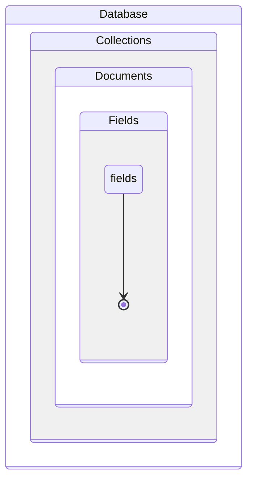

# Course Description
MongoDB is a tool to explore data structured as you see fit. As a NoSQL database, it doesn't follow the strict relational format imposed by SQL. By providing capabilities that typically require adding layers to SQL, it collapses complexity. With dynamic schema, you can handle vastly different data together and consolidate analytics. The flexibility of MongoDB empowers you to keep improving and fix issues as your requirements evolve. In this course, you will learn the MongoDB language and apply it to search and analytics. Working with unprocessed data from the official nobelprize.org API, you will explore and answer questions about Nobel Laureates and prizes.

# Flexibly Structured Data
This chapter is about getting a bird's-eye view of the Nobel Prize data's structure. You will relate MongoDB documents, collections, and databases to JSON and Python types. You'll then use filters, operators, and dot notation to explore substructure. 

MongoDB is a tool that helps you explore data without requiring it to have a strict, known structure. Because of this, it is possible to handle diverse data together and unify analytics.


Javascript is the language of web browsers. 
- It is a common way that web services and client code pass data.
- Objects map string keys to values, and arrays order values.
- Values are strings, numbers, the value "true, false, null" or another object or array

JSON data types have equivalents in Python, as shows the table below:

| **JSON**    | **Python**          |
|-------------|---------------------|
| Objects     | Dictionaries (dict) |
| Arrays      | Lists (list)        |
| **Values:** |                     |
| strings     | str                 |
| _numbers_   | int, float          |
| true/false  | True/ False         |
| null        | None                |

MongoDB, JSON, and Python

- A **database** maps names to collections
- A **collection** is like a list of dictionaries, callled by **documents** by MongoDB
- When a dictionary is a value within a document, that's a **subdocument**

| **MongoDB**  | **JSON**    | **Python**                       |
|--------------|-------------|----------------------------------|
| Databases    | Objects     | Dictionaries                     |
| Collections  | Arrays      | Lists                            |
| Documents    | Objects     | Dictionaries                     |
| Subdocuments | Objects     | Dictionaries                     |
| Values       | Value types | Value types + datetime, regex... |



Dot notation
- query arrays and subdocuments
- It is how MongoDB allows us to query document substructured

Exists operator allows to query for the existence or non-existence of fields

```python
# The Nobel Prize API data (base)
import requests
from pymongo import MongoClient
# Client connects to "localhost" by default
client = MongoClient()
# Create local "nobel" database on the fly
db = client["nobel"]
for collection_name in ["prizes", "laureates"]:
# collect the data from the API
    response = requests.get(
        "http://api.nobelprize.org/v1/{}.json".\
        format(collection_name[:-1] ))
    # convert the data to json
    documents = response.json()[collection_name]
    # Create collections on the fly
    db[collection_name].insert_many(documents)


# Acessing databases and collections
# 1 - using []
# client is a dictionary of databases
db = client["nobel"]
# database is a dictionary of collections
prizes_collection = db["prizes"]

# 2 - using .
# databases are attributes of a client
db = client.nobel # Connect to the "nobel" database
# collections are attributes of databases
prizes_collection = db["prizes"]


# Count documents in a collection
# Use empty document {} as a filter
filter = {}
# Count documents in a collection
n_prizes = db.prizes.count_documents(filter)
n_laureates = db.laureates.count_documents(filter)

# Find one document to inspect
doc = db.prizes.find_one(filter)


# Listing databases and collections
# Save a list of names of the databases managed by client
db_names = client.list_database_names()
print(db_names)

# Save a list of names of the collections managed by the "nobel" database
nobel_coll_names = client.nobel.list_collection_names()
print(nobel_coll_names)

# Count documents by providing a filter document to match
filter_doc = {
'born': '1845-03-27',
'diedCountry': 'Germany',
'gender': 'male',
'surname': 'Röntgen'
}
db.laureates.count_documents(filter_doc)

# Query operators
    # value in a list
db.laureates.count_documents({
'diedCountry': {
'$in': ['France', 'USA']}})

    # not equal
db.laureates.count_documents({
'diedCountry': {
'$ne': 'France'}})

    # exists
db.laureates.count_documents({"prizes.1": {"$exists": True}})
```

# Working with Distinct Values and Sets
This chapter is about dipping your toes into the pools of values for various fields. You'll collect distinct values, test for membership in sets, and match values to patterns. 

Distinct()
- Collect distinct values of a certain field passed as argument

```python
# Distinct
db.laureates.distinct("prizes.category")

# Pre-filtering distinct values
db.laureates.distinct("prizes.category", {"prizes.share": '4'})
    # or 
db.laureates.count_documents({"prizes.1": {"$exists": True}})

# Matching array fields
db.laureates.count_documents({
    "prizes": {"$elemMatch":
        {"category": "physics", "share": "1"}}})

# Regex
case_sensitive = db.laureates.distinct(
    "bornCountry",
    {"bornCountry": {"$regex": "Poland"}})

# Flag options for regular expressions
case_insensitive = db.laureates.distinct(
    "bornCountry",
    {"bornCountry": {"$regex": "poland", "$options": "i"}})

# Regex beginning
from bson.regex import Regex

db.laureates.distinct("bornCountry",
    {"bornCountry": Regex("^Poland")})
```


# Get Only What You Need, and Fast 
You can now query collections with ease and collect documents to examine and analyze with Python. But this process is sometimes slow and onerous for large collections and documents. This chapter is about various ways to speed up and simplify that process. 

# Aggregation Pipelines: Let the Server Do It For You 
You've used projection, sorting, indexing, and limits to speed up data fetching. But there are still annoying performance bottlenecks in your analysis pipelines. You still need to fetch a ton of data. Thus, network bandwidth and downstream processing and memory capacity still impact performance. This chapter is about using MongoDB to perform aggregations for you on the server. 