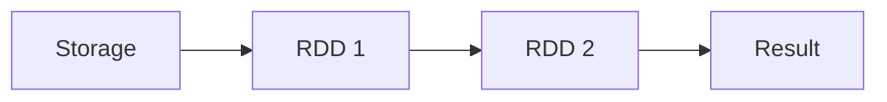

# Course Description
There's been a lot of buzz about Big Data over the past few years, and it's finally become mainstream for many companies. But what is this Big Data? This course covers the fundamentals of Big Data via PySpark. Spark is a "lightning fast cluster computing" framework for Big Data. It provides a general data processing platform engine and lets you run programs up to 100x faster in memory, or 10x faster on disk, than Hadoop. You’ll use PySpark, a Python package for Spark programming and its powerful, higher-level libraries such as SparkSQL, MLlib (for machine learning), etc. You will explore the works of William Shakespeare, analyze Fifa 2018 data and perform clustering on genomic datasets. At the end of this course, you will have gained an in-depth understanding of PySpark and its application to general Big Data analysis.

# Introduction to Big Data analysis with Spark 
this chapter introduces the exciting world of Big Data, as well as the various concepts and different frameworks for processing Big Data. You will understand why Apache Spark is considered the best framework for BigData. 

## Fundamentals of Big Data
Big data is a term to refer to the study and applications of data sets that are too complex for traditional data-processing software

The 3V's of Big Data:
- **Volume:** Size of the data
- **Variety:** Different sources and formats
- **Velocity:** Speed of the data

Concepts and Terminologies
- **Clustered computing:** Collection of resources of multiple machines
- **Parallel computing:** Simultaneous computation
- **Distributed computing:** Collection of nodes (networked computers) that run in parallel
- **Batch processing:** Breaking the job into small pieces and running them on individual machines
- **Real-time processing:** Immediate processing of data

Big data processing systems
- **Hadoop/MapReduce:** Scalable and fault tolerant framework written in Java
    - Open source and batch processing
- **Apacha Spark** General purpose and lightning fast cluster computing system
    - Open source and both batch and real-time data processing

Features of Apache Spark framework
- Distributed cluster computing framework
- Efficient in-memory computations for large data sets
- Lightning fast data processing framework
- Provides support for Java, Scala, Python, R and SQL.

Apache Spark Components:
- Spark SQL
- MLlib
- GraphX
- Spark Streaming
- Resilient Distributed Datasets (RDD) API (Apache Spark Core)
- *Note: RDDs in PySpark are a collection of partitions.*

Spark modes of deployment
- **Local mode:** Single machine, such as your laptop
    - Local model convenient for testing, debugging and demonstration
- **Cluster mode:** Set of pre-defined machines
    - Good for production
- Workflow: Local -> clusters
- No code change necessary

Pyspark: Spark with Python
- To support Python with Spark, Apache Spark Community released Pyspark
- Similar computation speed and power as Scala
- Pyspark APIs are similar to pandas and scikit-learn

Spark shell
- Interactive environment for running Spark jobs
- Helpful for fast interactive prototyping
- Spark's shells allow interacting with data on disk or in memory
- Three different Spark shells:
    - Spark-shell for Scala
    - Pyspark-shell for Python
    - SparkR for R

PySpark shell
- is the Python-based command line tool
- allows data scientists interface with Spark data structures
- support connecting to a cluster

Understanding SparkContext
- Spark Context is an entry of point into the world of Spark
- An entry point is where control is transferred from the OS to the provided program
- An entry of point is a way of connecting to Spark cluster
- An entry of point is like a key to the house
- Pyspark has a default SparkContext called sc

Inspecting SparkContext
```Python
# Print the version of SparkContext
print("The version of Spark Context in the PySpark shell is", sc.version)

# Print the Python version of SparkContext
print("The Python version of Spark Context in the PySpark shell is", sc.pythonVer)

# Print the master of SparkContext
print("The master of Spark Context in the PySpark shell is", sc.master)
```

Loading data in Pyspark

In PySpark, we express our computation through operations on distributed collections that are automatically parallelized across the cluster.

In the code below, you'll load the data from a local file in PySpark shell. 

```python
# SparkContext's parallelize() method
rdd = sc.parallelize([1,2,3,4,5])

# SparkContext's textFile() method
rdd2 = sc.textFile("text.txt")
```
What are anonymous functions in Python?
- Lambda functions are anonymous functions in Python
- Very powerful and used in Python. Quite efficient with ```map()``` and ```filter```()
- Lambda functions create functions to be called later similar to ```def```
- It returns the functions instead of assigning it to a name. It returns functions without any name (i.e. anonymous)
- In practice, they are used as a way to inline a function definition or to defer execution of a code

Lambda function syntax
```python
# The general form of lambda function
lambda arguments: expression

# Example of lambda function
double = lambda x: x * 2
```

Difference between def vs lambda functions
- No return statement for lambda
- Can put lambda function anywhere
- Lambda function doesn't need to assign it to a variable, unlike def

```python
def cube(x):
    return x ** 3
g = lambda x: x ** 3
print(cube(10))
print(g(10))
```

Map() - Use of Lambda function in Python
- map() function takes a function and a list and returns a new list which contains items returned by that function for each item
```python
# General syntax of map()
map(function, list)

# Example of map()
items = [1,2,3,4]
list(map(lambda x: x + 3, items))
```

Filter() - Use of Lambda function in Python
- filter() function takes a function and a list and returns a new list for which the function evaluates as true

```python
# General syntax of filter()
filter(function, list)

# Example of filter()
items = [1,2,3,4]
list(filter(lambda x: x%2 != 0, items))
```

# Programming in PySpark RDD’s 
Chapter description: The main abstraction Spark provides is a resilient distributed dataset (RDD), which is the fundamental and backbone data type of this engine. This chapter introduces RDDs and shows how RDDs can be created and executed using RDD Transformations and Actions. 

RDDs
- resilient distributed dataset
- It is an immutable collection of data distributed across the cluster
- Spark's core abstraction for working with data
- Resilient: the ability to withstand failures and recompute missing or damaged partitions 
- Distributed: spanning the jobs across multiple nodes in the cluster (for efficient computation)
- Datasets: a collection of partitioned data

When Spark starts processing data, it divides the data into partitions and distributes the data across cluster nodes, with each node containing a slice of data.

How to create RDDs
- Parallelizing an existing collection of objects
    - RDDs are created from a list or a set using SparkContext's parallelize method (parallelize())
- External datasets
    - A more common way to do it is to load data from external datasets such as files stored in HDFS or objects in buckets
    - textFile() for creating RDDs from external datasets
    - lines in a text file:
- From existing RDDs

```python
# RDD created from a Python list
num_RDD = sc.parallelize([1,2,3,4])

# RDD created from a Python string
str_RDD = sc.parallelize("This is a string")

# RDD created using textFile method
file_RDD = sc.textFile("README.md")

# getNumPartitions()
file_RDD.getNumPartitions()
```

Partitions
- A partition is a logical division of a large distributed data set

## Spark Operation
Pyspark supports two different types of operations:
- Transformations (create new RDDs)
- Actions (perform computation on the RDD)

Basic RDD Transformations
- map(): applies a function to all elements in the RDD
- filter() returns a new RDD with only the elements that pass the condition
- flatMap() returns multiple values for each element in the original RDD
- union() union two or more RDDs

```python
# map() Transformation
RDD = sc.parallelize([1,2,3,4])
RDD_map = RDD.map(lambda x: x * x)

# filter() Transformation
RDD = sc.parallelize([1,2,3,4])
RDD_filter = RDD.filter(lambda x: x > 2)

# flatMap() Transformation
RDD = sc.parallelize(["hello world", "how are you"])
RDD_flatmap = RDD.flatMap(lambda x: x.split(" "))

# union() Transformation
inputRDD = sc.textFile("logs.txt")
errorRDD = inputRDD.filter(lambda x: "error" in x.split())
warningsRDD = inputRDD.filter(lambda x: "warnings" in x.split())
combinedRDD = errorRDD.union(warningsRDD)
```



RDD Actions
Actions are the operations that are applied on RDDs to return a value after running a computation
- Operator return a vale after running a computation
- Basic RDD Actions
    - collect(): returns all the elements of the dataset as an array
    - take(N): returns an array with the first N elements of the dataset
    - first(): print the first element of the RDD
    - count(): return the number of elements in the RDD

## Working with Pair RDDs in Pyspark
Introduction to pair RDDs in Pyspark:
- Real life datasets are usually key/value pairs (dictionaries, json)
- Each row is a key and maps to one or more values
- **Pair RDD is a special data structure to work with this kind of datasets**
- Pair RDD: Key is the identifier and value is data
- Pair RDDs are still RDDs and thus use all the transformations available to regular RDDs.  

Two common ways to create pair RDDs
1. From a list of key-value tuple
1. From a regular RDD (Array)

```python
# Get the data into key/value form for paired RDD
my_tuple = [('Leo', 29), ('Ananda', 27), ('Mauricio', 53), ('Rosa', 59)]
pairRDD_tuple = sc.parallelize(my_tuple)

my_list = ['Leo 29', 'Ananda 27', 'Mauricio 53', 'Rosa 59']
regularRDD = sc.parallelize(my_list)
PairRDD_RDD = regularRDD.map(lambda s: (s.split(' ')[0], s.split(' ')[1]))
```
Transformations on pair RDDs
- All regular transformations work on pair RDD
- Have to **pass** functions that operate on **key value pairs** rather than on individual elements
- Examples of paired RDD Transformations
  - reduceByKey(func): Combine values with the same key
  - groupByKey(): Group values with the same key
  - sortByKey(): Return an RDD sorted by the key
  - join(): Join two pair RDDs based on their key

reduceByKey()
- it combines values with the same key
- It runs parallel operations for each key in the dataset
- In other words, operates on key, value (k,v) pairs and merges the values for each key.
- It is a transformation and not action

sortByKey()
- it orders pair RDD by key
- it returns and RDD sorted by key in ascending or descending order

groupByKey()
- groups all the values with the same key in the pair RDD

join()
- it joins the two pair RDDs based on their key

```python
# reduceByKey() example
regularRDD = sc.parallelize([("Messi", 23), ("Ronaldo", 34),
("Neymar", 22), ("Messi", 24)])
pairRDD_reducebykey = regularRDD.reduceByKey(lambda x,y : x + y)
pairRDD_reducebykey.collect()

output: [('Neymar', 22), ('Ronaldo', 34), ('Messi', 47)]

# sortByKey() example
pairRDD_reducebykey_rev = pairRDD_reducebykey.map(lambda x: (x[1], x[0]))
pairRDD_reducebykey_rev.sortByKey(ascending=False).collect()

output: [(47, 'Messi'), (34, 'Ronaldo'), (22, 'Neymar')]

# groupByKey() example
airports = [("US", "JFK"),("UK", "LHR"),("FR", "CDG"),("US", "SFO")]
regularRDD = sc.parallelize(airports)
pairRDD_group = regularRDD.groupByKey().collect()
for cont, air in pairRDD_group:
print(cont, list(air))

output:
FR ['CDG']
US ['JFK', 'SFO']
UK ['LHR']

# join() example
RDD1 = sc.parallelize([("Messi", 34),("Ronaldo", 32),("Neymar", 24)])
RDD2 = sc.parallelize([("Ronaldo", 80),("Neymar", 120),("Messi", 100)])
RDD1.join(RDD2).collect()

output: 
[('Neymar', (24, 120)), ('Ronaldo', (32, 80)), ('Messi', (34, 100))]
```
## More actions
reduce()
- reduce(func) action is used for aggregating the elements of a regular RDD
- The function should be commutative (changing the order of the operands does not change the result) and associative

saveAsTextFile()
- It saves RDD into a text file inside a directory with each partition as a separate file

coalesce()
- it is used to save RDD as a single text file
- returns a new RDD that is reduced into a single partition

countByKey() action
- it is only available for type (k,v)
- it counts the number of elements for each key

collectASMap()
- It returns key-value pairs in the RDD as a dictionary

```python
# reduce example: calculates the sum of all the elements in an RDD
x = [1,3,4,6]
RDD = sc.parallelize(x)
RDD.reduce(lambda x, y: x + y)
output: 14

# saveAsTextFile() example
RDD.saveAsTextFile("tempFile")

# coalesce() example
RDD.coalesce(1).saveAsTextFile("tempFile")

# countByKey example
rdd = sc.parallelize([("a", 1), ("b", 1), ("a", 1)])
for key, val in rdd.countByKey().items():
print(key, val)

output: 
('a', 2)
('b', 1)

# collectAsMap() example
sc.parallelize([(1, 2), (3, 4)]).collectAsMap()

output: {1: 2, 3: 4}
```

# PySpark SQL & DataFrames
In this chapter, you'll learn about Spark SQL which is a Spark module for structured data processing. It provides a programming abstraction called DataFrames and can also act as a distributed SQL query engine. This chapter shows how Spark SQL allows you to use DataFrames in Python. 

What are Pypark Dataframes?
- PySpark SQL is a **Spark library for structured data**. It provides more information about the structure of data and computation.
- PySpark DataFrames is an **immutable** distributed collection of data with named columns
- Designed for processing both structured (relational database) and semi-structured data (e.g. JSON)
- Dataframe API is available in Python, R, Scala, and Java
- DataFrames in Pypark **support** both SQL **queries** (SELECT * from table) **or** expression **methods**(df.select())
- PySpark DataFrame is a perfect for data visualization compared to RDDs because of its inherent structure and schema.

SparkSession - Entry point for DataFrame API
- **SparkContext** is the **main entry point** for creating RDDs
- **SparkSession** provides a **single point of entry** to interact with Spark DataFrames
- SparkSession is used to create DataFrames, register DataFrames, execute SQL queries
- The SparkSession does for DataFrames what the SparkContext does for RDDs
- SparkSession is available in PySpark shell as ```spark```

Creating DataFrames in PySpark
1. From existing RDDs using SparkSession's createDataFrame() method
1. From various data sources (CSV, JSON. TXT) using SparkSession's read method
- Schema controls the data and helps DataFrames to optimize queries
- Schema provides information about column name, type of data in the column, empty values etc.

```python
# Create a DF from RDD
iphones_RDD = sc.parallelize([
("XS", 2018, 5.65, 2.79, 6.24),
("XR", 2018, 5.94, 2.98, 6.84),
("X10", 2017, 5.65, 2.79, 6.13),
("8Plus", 2017, 6.23, 3.07, 7.12)
])
names = ['Model', 'Year', 'Height', 'Width', 'Weight']
iphones_df = spark.createDataFrame(iphones_RDD, schema=names)

# Create a DF from reading a CSV/JSON/TXT
df_csv = spark.read.csv("people.csv", header=True, inferSchema=True)
df_json = spark.read.json("people.json", header=True, inferSchema=True)
df_txt = spark.read.txt("people.txt", header=True, inferSchema=True)
```

## DataFrames Operations
DataFrame operations:
1. Transformations: transformations creates new dataframes
1. Actions

DataFrame oTransformations:
- select(): extracts one or more columns from a dataFrame
- filter(): filters  out the rows based on a condition
- groupby(): group a variable
- orderby(): sorts the DataFrame based on one or more columns
- dropDuplicates(): removes the duplicate rows of a DataFrame
- withColumnRenamed(): rename an existing column

DataFrame Actions:
- show(): prints the first 20 rows by default
- count()
- describe(): compute summary statistics of numerical columns in the DataFrame
- Columns actions: prints the columns of a DataFrame


```python
# select()
df_if_age = test.select('Age')

# show
df_if_age.show(3)

# filter
new_df_age21 = new_df.filter(new_df.Age > 21)

# groupby() and count()
test_df_age_group = test_df.groupby('Age')
test_df_age_group.count().show(3)

# orderby
test_df_age_group.count().orderBy('Age').show(3)

# withColumnRenamed
test_df_sex = test_df.withColumnRenamed('Gender', 'Sex')

# Prints the types of columns in the DataFrame
test_df.printSchema()

# columns operator
test_df.columns

# describe()
test_df.describe().show()
```

DataFrame API vs SQL queries

DataFrames can easily be manipulated using SQL queries in PySpark. 

The sql() function on a SparkSession enables applications to run SQL queries programmatically and returns the result as another DataFrame.

Spark SQL operations generally return DataFrames. This means you can freely mix DataFrames and SQL.

Summary:
- In Pyspark it's possible to interact with SparkSQL through DataFrame API and SQL queries.
- The DataFrame API provides a programmatic domain-specific language (DSL) for data
- DataFrame transformations and actions are easier to construct programmatically
- SQL queries can be concise and easier to understand and portable
- The operations on DataFrames can also be done using SQL queries.

Executing SQL Queries
- The SparkSession sql() method executes SQL query
- sql() method takes a SQL statement as an argument and returns the result as DataFrame

```python
# Create or replace a temporary view
df.createOrReplaceTempView("table1")

# Query
df2 = spark.sql("SELECT field1, field2 FROM table1")
df2.collect()
```

Data Visualization in Pyspark using DataFrames
- Data visualization is a way of representing your data in graphs or charts
- Open source plotting tools to aid visualization in Python
    - Matplotlib
    - Seaborn
    - Bokeh
    - Streamlit
    - *None of these libraries can be used directily with Pyspark's dataframes*
- Plotting graphs using Pyspark DataFrames is done using three methods
    1. pyspark_dist_explore library
    1. toPandas()
    1. handySpark library: is a package designed to improve PySpark user experience

Pyspark_dist_explore
- It is a library that provides quick insights into DataFrames
- Currently three functions available: hist(), distplot() and pandas_histogram()

**Pandas df vs Pyspark df**
Pandas won't work in every case. It is a single machine tool and constrained by single machine limits. Their size is limited by the server memory, which process with the power of a single server.

- Pandas df are in-memory, single server based structures and operations on PySpark run in parallel
- The result is generated as we apply any operation in Pandas whereas operations in Pyspark df are lazy evaluation
- Pandas df are mutable and Pyspark df are immutable
- Pandas API support more operations than Pyspark Dataframe API.

```python
# pyspark_dist_explore
test_df = spark.read.csv("test.csv", header=True, inferSchema=True)
test_df_age = test_df.select('Age')
hist(test_df_age, bins=20, color="red")

# Pandas
test_df_sample_pandas = test_df.toPandas()
test_df_sample_pandas.hist('Age')

# HandySpark
hdf = test_df.toHandy()
hdf.cols["Age"].hist()
```

# Machine Learning with PySpark MLlib 
PySpark MLlib is the Apache Spark scalable machine learning library in Python consisting of common learning algorithms and utilities. Throughout this last chapter, you'll learn important Machine Learning algorithms. You will build a movie recommendation engine and a spam filter, and use k-means clustering. 

PySpark MLlib:
PySpark MLlib is a machine learning library. According to Wikipedia, machine learning is a scientific discipline that explores the construction and study of algorithms that can learn from data.
- It is a component of Apache Spark for machine learning
- Its goal is to make practical machine learning scalable and easy
- Various tools provided by MLlib include:
    - ML Algorithms: collaborative filtering, classification, and clustering
    - Featurization: feature extraction, transformation, dimensionality reduction, and selection
    - Pipelines: tools for constructing, evaluating, and tuning ML Pipelines.

Why PySPark MLlib?
- Scikit-learn is a popular Python library for data mining and machine learning
- Scikit-learn algorithms only work for small datasets on a single machine
- Spark's MLlib algorithms are designed for parallel processing on a cluster
- Supports languages such as Scala, Java, and R
- Provides a high-level API to build machine larning pipelines

PySpark MLlib Algorithms
- Classification (Binary and Multiclass) and regression, e.g: decision trees naive bayes, ridge regression
- Collaborative filtering: Alternating least squares (ALS)
- Clustering: K-means, Gaussian mixture, Bisecting K-means and Streaming K-Means

The three C's of machine learning in PySpark MLlib
- Collaborative filtering (recommender engines): produce recommendations
- Classification: Identifying to which of a set of categories a new observation
- Clustering: Groups data based on similar characteristics

Imports:

```python
from pyspark.mllib.recommendation import ALS # Alternating Least Squares class
from pyspark.mllib.classification import LogisticRegressionWithLBFGS
from pyspark.mllib.clustering import KMeans
```

*pyspark.mllib can only support RDDs unless you change DataFrames to RDDs. pyspark.mllib is the builtin library for RDD-based API.*

## Collaborative filtering
Collaborative filtering is a method of making automatic predictions about the interests of a user by collecting preferences or taste information from many users
- Collaborative filtering is finding users that **share common interests**
- Collaborative filtering is commonly used for **recommender systems**
- Collaborative fitering approaches
    - User-User Collaborative filtering: Finds users that are similar to the target user
    - Item-Item Collaborative filtering: Finds and recoomends items that are similar to items with the target user

Rating class in pyspark.mllib.recommendation submodule
- The rating class is a weapper around tuple (user, product and rating)
- Useful for parsing the RDD and creating a tuple of user, product and rating

Splitting the data using randomSplit()
- Splitting data into training and testing sets is important for evaluating predictive modeling
- Typically a large portion of data is assigned to training compared to testing data
- PySpark's ```randomSplit()``` method randomly splits with the provided wights and returns multiple RDDs

Alternating Least Squares (ALS)
- It provides collaborative filtering
- ALS.train(ratings, rank, iterations)
    - rank (the number of latent factors in the model)
    - iterations (number of iterations to run)

predictAll() – Returns RDD of Rating Objects
- The predictAll() method returns a list of predicted ratings for input user and product pair
- The method takes in an RDD without ratings to generate the ratings

Model evaluation using Mean Square Error (MSE)
The MSE measures the average value of the square of the errors between what is estimated and the existing data (actual rating - predicted rating)


```python
# Rating
from pyspark.mllib.recommendation import Rating
r = Rating(user = 1, product = 2, rating = 5.0)
(r[0], r[1], r[2])

# randomSplit()
data = sc.parallelize([1, 2, 3, 4, 5, 6, 7, 8, 9, 10])
traning, test=data.randomSplit([0.6], [0.4])
training.collect()
test.collect()

# Recommendation ALS
r1 = Rating(1, 1, 1.0)
r2 = Rating(1, 2, 2.0)
r3 = Rating(2, 1, 2.0)
ratings = sc.parallelize([r1, r2, r3])
ratings.collect()
model = ALS.train(ratings, rank=10, iterations=10)

# predictAll()
unrated_RDD = sc.parallelize([(1, 2), (1, 1)])
predictions = model.predictAll(unrated_RDD)
predictions.collect()

# MSE
rates = ratings.map(lambda x: ((x[0], x[1]), x[2]))
rates.collect()

preds = predictions.map(lambda x: ((x[0], x[1]), x[2]))
preds.collect()

rates_preds = rates.join(preds)
rates_preds.collect()

MSE = rates_preds.map(lambda r: (r[1][0] - r[1][1])**2).mean()
```

## Classification

Classification
- is a supervised machine learning algorith for sorting the input data into different categories
- in other words, it identifies which category an item belongs to.
    - E.g.: Whether an email is spam or non-spam, based on labeled examples of other items

Logistic regression predicts a binary response based on some variables

Working with Vectors
- PySPark MLlib contains specific data types Vectors and LabelledPoint
- Two types of Vectors
    - Dense Vector: store all their entries in an array of floating point numbers
    - Sparse Vector: store only the nonzero values and their indices

LabeledPoint()
- A labeledPoint is a wrapper for input features and predicted value
- For binary classification of Logistic Regression, a label is either 0 (negative) or 1 (positive)

HashingTF()
- This algorithm is used to map feature value to indices in the feature vector

Logistic Regression using LogisticRegressionWithLBFGS
- Logistic Regression using Pyspark MLlib is achieved using LogisticRegressionWithLBFGS
class

```python
# LabeledPoint
positive = LabeledPoint(1.0, [1.0, 0.0, 3.0])
negative = LabeledPoint(0.0, [2.0, 1.0, 1.0])

# HashingTF
from pyspark.mllib.feature import HashingTF
sentence = "hello hello world"
words = sentence.split()
tf = HashingTF(10000)
tf.transform(words)

# Logistic Regression
data = [
LabeledPoint(0.0, [0.0, 1.0]),
LabeledPoint(1.0, [1.0, 0.0]),
]
RDD = sc.parallelize(data)

lrm = LogisticRegressionWithLBFGS.train(RDD)

lrm.predict([1.0, 0.0])
lrm.predict([0.0, 1.0])
```

## Clustering

Clustering 
- is the unsupervised learning task to organize a collection of data into groups
- involves grouping objects into clusters of high similarity with no labels
- Unlike the supervised tasks, where data is labeled, clustering can be used to make sense of unlabeled data.

PySpark MLlib library currently supports the following clustering models:
- K-means
- Gaussian mixture
- Power iteration clustering (PIC)
- Bisecting k-means
- Streaming k-means

Train a K-means clustering model
- K-means is an unsupervised method that takes data points in an input data and will identify which data points belong to each one of the clusters
- Training K-means model is done using ```KMeans.train()``` method


```python
# K-means with Spark MLlib
RDD = sc.textFile("WineData.csv"). \
map(lambda x: x.split(",")).\
map(lambda x: [float(x[0]), float(x[1])])

# K-means clustering model
from pyspark.mllib.clustering import KMeans
model = KMeans.train(RDD, k = 2, maxIterations = 10)
model.clusterCenters

# Evaluating the K-means Model
from math import sqrt
def error(point):
    center = model.centers[model.predict(point)]
    return sqrt(sum([x**2 for x in (point - center)]))

WSSSE = RDD.map(lambda point: error(point)).reduce(lambda x, y: x + y)
print("Within Set Sum of Squared Error = " + str(WSSSE)) # Within Set Sum of Squared Error (WSSSE)

# Visualizing clusters
wine_data_df = spark.createDataFrame(RDD, schema=["col1", "col2"])
wine_data_df_pandas = wine_data_df.toPandas()

cluster_centers_pandas = pd.DataFrame(model.clusterCenters, columns=["col1", "col2"])
cluster_centers_pandas.head()

plt.scatter(wine_data_df_pandas["col1"], wine_data_df_pandas["col2"]);
plt.scatter(cluster_centers_pandas["col1"], cluster_centers_pandas["col2"], color="red", marker="x"
```