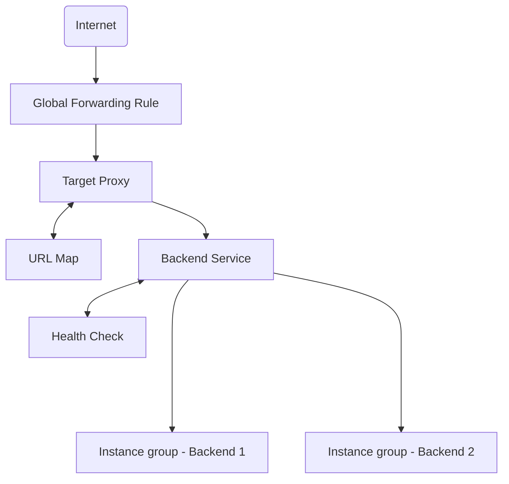
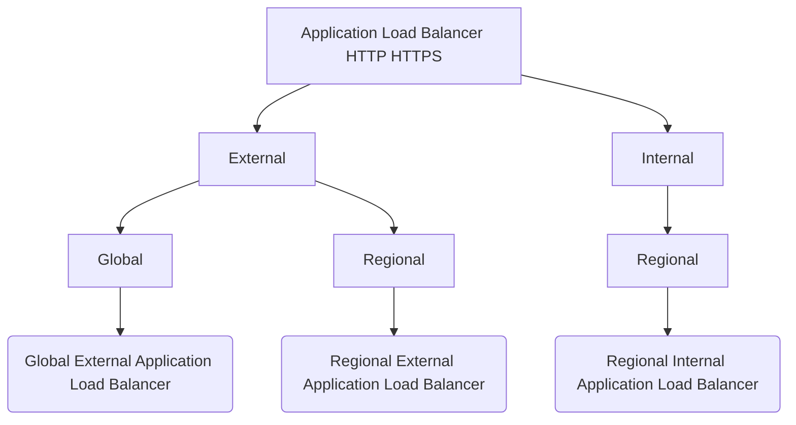
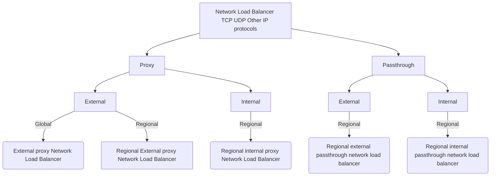

# Elastic Google Cloud Infrastructure: Scaling and Automation
This course explores and deploys solution elements, including securely interconnecting networks, load balancing, autoscaling, infrastructure automation and managed services.

## Interconnecting Network
Different applications and workloads require different network connectivity solutions. Google supports multiple ways to connect your infrastructure to GCP. This module focus on GCP's hybrid connectivity products, which Cloud VPN, Cloud Interconnect, and Peering

### Cloud VPN

What is the purpose of Virtual Private Networking (VPN)? A: To enable a secure communication method (a tunnel) to connect two trusted environments through an untrusted environment, such as the Internet. VPNs use IPSec tunnels to provide an encapsulated and encrypted path through a hostile or untrusted environment.

Google Cloud offers two types of Cloud VPN gateways:
1. HA VPN
1. Classic VPN

*All Cloud VPN gateways created before the introduction of HA VPN are considered Classic VPN gateways.*

Classic VPN:
- securely connects your on-premises network to your Google Cloud VPC network through an IPsec VPN tunnel.
- Traffic traveling between the two networks is encrypted by one VPN gateway, then decrypted by the other VPN gateway.
- This protects your data as it travels over the public internet, and that’s why **Classic VPN is useful for low-volume data connections**.
- supports site-to-site VPN, static and dynamic routes, and IKEv1 and IKEv2 ciphers.
- doesn't support use cases where client computers need to “dial in” to a VPN using client VPN software.


In order to connect to your on-premises network and its resources, you need to configure your Cloud VPN gateway, on-premises VPN gateway, and two VPN tunnels.
- Cloud VPN gateway is a regional resource that uses a regional external IP address.
- on-premises VPN gateway can be a physical device in your data center or a physical or software-based VPN offering in another cloud provider's network. This VPN gateway also has an external IP address.
- A VPN tunnel then connects your VPN gateways (In order to create a connection between two VPN gateways, you must establish two VPN tunnels.)
- Each tunnel defines the connection from the perspective of its gateway, and traffic can only pass when the pair of tunnels is established.
- the maximum transmission unit, or **MTU**, for your on-premises VPN gateway **cannot be greater than 1460 bytes**.

HA VPN:
- securely connect your on-premises network to your Virtual Private Cloud (VPC) network through an IPsec VPN connection in a single region.
- provides an SLA of 99.99% service availability. To guarantee a 99.99% availability SLA for HA VPN connections, you must properly configure two or four tunnels
- When you create an HA VPN gateway, Google Cloud automatically chooses two external IP addresses, one for each of its fixed number of two interfaces.
- Each of the HA VPN gateway interfaces supports multiple tunnels.
- You can also create multiple HA VPN gateways.
- You can configure an HA VPN gateway with only one active interface and one external IP address; But this don't provide a 99,99% availability anymore.
- VPN tunnels connected to HA VPN gateways must use dynamic (BGP) routing.
- supports site-to-site VPN in one of the following recommended topologies or configuration scenarios: 
    - An HA VPN gateway to peer VPN devices 
    - An HA VPN gateway to an AWS virtual private gateway
    - Two HA VPN gateways connected to each other

There are three typical peer *gateway configurations* for HA VPN.
1. An HA VPN gateway to two separate peer VPN devices
    - Each peer device has one interface and one external IP address.
    - The HA VPN gateway uses two tunnels, one tunnel to each peer device.
    - provides redundancy and failover
    - A second physical gateway lets you take one of the gateways offline for software upgrades or other scheduled maintenance.
    - the REDUNDANCY_TYPE for this configuration takes the value **TWO_IPS_REDUNDANCY**.
1. An HA VPN gateway to one peer VPN device that uses two separate IP addresses
    - E.g. Two tunnels from one AWS virtual private gateway to one interface of the HA VPN gateway, and two tunnels from the other AWS virtual private gateway to the other interface of the HA VPN gateway.
1. An HA VPN gateway to one peer VPN device that uses one IP address

In order to use dynamic routes, you need to configure Cloud Routers.
- Cloud Router can manage routes for a Cloud VPN tunnel using Border Gateway Protocol, or BGP.
- *This routing method (BGP) allows for routes to be updated and exchanged without changing the tunnel configuration.*
- To automatically propagate network configuration changes, the VPN tunnel uses Cloud Router to establish a BGP session between the VPC and the on-premises VPN gateway, which must support BGP. Instances in the new subnets can start sending and receiving traffic immediately

### Configuring Google Cloud HA VPN
In this lab, you learn how to perform the following tasks:

- Create two VPC networks and instances.
- Configure HA VPN gateways.
- Configure dynamic routing with VPN tunnels.
- Configure global dynamic routing mode.
- Verify and test HA VPN gateway configuration.

#### Set up a Global VPC environment
- create a VPC network called vpc-demo: `gcloud compute networks create vpc-demo --subnet-mode custom`
- create subnet: 
```
gcloud compute networks subnets create vpc-demo-subnet1 \
--network vpc-demo --range 10.1.1.0/24 --region "REGION"
```
- Create a firewall rule to allow all custom traffic within the network:
```
gcloud compute firewall-rules create vpc-demo-allow-custom \
  --network vpc-demo \
  --allow tcp:0-65535,udp:0-65535,icmp \
  --source-ranges 10.0.0.0/8
```
- Create a firewall rule to allow SSH, ICMP traffic from anywhere
```
gcloud compute firewall-rules create vpc-demo-allow-ssh-icmp \
    --network vpc-demo \
    --allow tcp:22,icmp
```

#### Set up an HA VPN gateway
- create an HA VPN in the vpc-demo network: `gcloud compute vpn-gateways create vpc-demo-vpn-gw1 --network vpc-demo --region "REGION"`
- Describe: `gcloud compute vpn-gateways describe vpc-demo-vpn-gw1 --region "REGION"`
- Create a cloud router in the vpc-demo network: 
```
gcloud compute routers create vpc-demo-router1 \
    --region "REGION" \
    --network vpc-demo \
    --asn 65001
```

#### Create two VPN tunnels
- Create the first VPN tunnel in the vpc-demo network
```
gcloud compute vpn-tunnels create vpc-demo-tunnel0 \
    --peer-gcp-gateway on-prem-vpn-gw1 \
    --region "REGION" \
    --ike-version 2 \
    --shared-secret [SHARED_SECRET] \
    --router vpc-demo-router1 \
    --vpn-gateway vpc-demo-vpn-gw1 \
    --interface 0
```

#### Create Border Gateway Protocol (BGP) peering for each tunnel
- Create the router interface for tunnel0 in network vpc-demo:
```
gcloud compute routers add-interface vpc-demo-router1 \
    --interface-name if-tunnel0-to-on-prem \
    --ip-address 169.254.0.1 \
    --mask-length 30 \
    --vpn-tunnel vpc-demo-tunnel0 \
    --region "REGION"
```
- Create the BGP peer for tunnel0 in network vpc-demo:
```
gcloud compute routers add-bgp-peer vpc-demo-router1 \
    --peer-name bgp-on-prem-tunnel0 \
    --interface if-tunnel0-to-on-prem \
    --peer-ip-address 169.254.0.2 \
    --peer-asn 65002 \
    --region "REGION"
```

### Cloud Interconnect and Peering
There are different Cloud Interconnect and Peering services available to connect your infrastructure to Google’s network.

These services can be split into **Dedicated versus Shared** connections and **Layer 2 versus Layer 3** connections.

The services are:
- Direct Peering
- Carrier Peering
- Dedicated Interconnect
- Partner Interconnect

Dedicated connections provide a direct connection to Google’s network.
Shared connections provide a connection to Google’s network through a partner.

Layer 2 connections use a VLAN that pipes directly into your GCP environment, providing connectivity to internal IP addresses in the RFC 1918 address space. Layer 3 connections provide access to Google Workspace services, YouTube, and Google Cloud APIs using public IP addresses.

Cloud VPN uses the public internet, but traffic is encrypted and provides access to internal IP addresses. That’s why Cloud VPN is a useful addition to Direct Peering and Carrier Peering.

|         | **Dedicated**               | **Shared**                                |
|---------|-------------------------|---------------------------------------|
| **Layer 3** | Direct  Peering         | Carrier Peering, Partner Interconnect |
| **Layer 2** | Dedicated  Interconnect | Partner Interconnect                  |

#### Cloud Interconnect
Dedicated Interconnect provides direct physical connections between your on-premises network and Google’s network.

This enables you to transfer large amounts of data between networks, which can be more cost-effective than purchasing additional bandwidth over the public internet.

To use Dedicated Interconnect, it's necessary to provision a cross connect between the Google network and your own router in a common colocation facility.

When you are distance from the dedicated interconnection points, consider using Partner Interconnect.

Partner Interconnect provides connectivity between your on-premises network and your VPC network through a supported service provider. This is useful if your data center is in a physical location that cannot reach a Dedicated Interconnect colocation facility or if your data needs don't warrant a Dedicated Interconnect.

**Cross-Cloud Interconnect** helps you to establish high-bandwidth dedicated connectivity between Google Cloud and another cloud service provider. When you buy Cross-Cloud Interconnect, Google provisions a dedicated physical connection between the Google network and that of another cloud service provider. Cross-Cloud Interconnect connections are available in two sizes: 10 Gbps or 100 Gbps.

The main differences between the interconnect options are the connection capacity and the requirements for using a service.
- The IPsec VPN tunnels that Cloud VPN offers have a capacity of 1.5 to 3 Gbps per tunnel and require a VPN device on your on-premises network.
- Dedicated Interconnect has a capacity of 10 Gbps or 100 Gbps per link and requires you to have a connection in a Google-supported colocation facility
- Partner Interconnect has a capacity of 50 Mbps to 50 Gbps per connection, and requirements depend on the service provider.
- Cross-Cloud Interconnect connections are available in two sizes: 10 Gbps or 100 Gbps.

- If you need a lower cost solution or have lower bandwidth needs you can choose Cloud VPN.
- If you need an enterprise-grade connection to Google Cloud that has higher throughput, you can choose Dedicated Interconnect or Partner Interconnect.
- If you need to connect to another cloud service provider, choose Cross-Cloud Interconnect.

*Google recommends using Cloud Interconnect instead of Direct Peering and Carrier Peering, which you would only use in certain circumstances.*
| **Connection**            | **Provides**                                                                             | **Capacity**                       | **Requirements**                                                   | **Access Type** |
|---------------------------|------------------------------------------------------------------------------------------|------------------------------------|--------------------------------------------------------------------|-----------------|
| VPN Tunnel                | Encrypted tunnel to VPC networks through the public internet                             | 1.5-3 Gbps per tunnel              | Remote VPN gateway                                                 | Internal IP     |
| Dedicated  Interconnect   | Dedicated, direct connection to  VPC networks                                            | 10 Gbps or 100 Gbps per link       | Connection in  colocation facility                                 | Internal IP     |
| Partner  Interconnect     | Dedicated bandwidth connection to VPC networksthough a service partner                   | 50 Mbps -  50 Gbps per connection  | Service provider                                                   | Internal IP     |
| Cross-Cloud  Interconnect | Dedicated physical connection between VPC network and network hosted by service provider | 10 Gbps or 100 Gbps per connection | Primary and redundant ports (GC and remote cloud service provider) | Internal IP     |

#### Peering
Cloud Peering services: direct peering and carrier peering

With this connection, you will be able to exchange Internet traffic between your network and Google's at one of the Google's broad-reaching edge network locations.

Direct peering with Google is done by exchanging BGP routes between Google and the peering entity.

**Unlike dedicated interconnect, direct peering does not have an SLA.**

GCP's Edge Points of Presence, or PoPs, are where Google's network connects to the rest of the Internet via peering.

When you are distance from the PoPs, consider connect via a carrier peering partner. It also does not have an SLA.

Direct peering has a capacity of 10 Gbps per link and requires you to have a connection in a GCP Edge Point of Presence. Carrier peering's capacity and requirements vary depending on the service provider that you work with.

| **Connection**  | **Provides**                                                | **Capacity**                      | **Requirements**      | **Access Type** |
|-----------------|-------------------------------------------------------------|-----------------------------------|-----------------------|-----------------|
| Direct Peering  | Dedicated, direct connection to Google's network            | 10 Gbps per link                  | Connection in GC PoPs | Public IP       |
| Carrier Peering | Peering through service provider to Google's public network | Varies based on partner  offering | Service provider      | Public IP       |

#### Choosing a connection
Interconnect services provide direct access to RFC1918 IP addresses in your VPC, with an SLA. 
Peering services, in contrast, offer access to Google public IP addresses only, without an SLA.

Choosing:
- Do you need to extend your network for Workspace services, youtube or Google Cloud APIs?
    - If yes: Choose Peering services according with the requesites of the PoP
    - if no: Choose Interconnect service

To choose interconnect service:
- Need dedicated high bandwidth?
    - If No: Encryption managed by Google? If yes Cloud VPN, If no, self-managed encryption tunnels
    - If Yes: Dedicated interconnect, partner interconnect or cross cloud interconnect

Within Partner Interconnect, you can choose between L2 Partner Interconnect and L3 Partner Interconnect. 
- if you need BGP peering Choose L2 Partner Interconnect
- if you don't need BGP peering Choose L3 Partner Interconnect

### Shared VPC and VPC Peering
Many organizations commonly deploy multiple, isolated projects with multiple VPC networks and subnets. This submodule covers two configurations for sharing VPC networks across GCP projects.

Shared VPC 
- allows you to share a network across several projects in your GCP organization.
- allows an organization to connect resources from multiple projects to a common Virtual Private Cloud (VPC) network
- communicate with each other securely and efficiently by using internal IP addresses
- lets organization administrators delegate administrative responsibilities, such as creating and managing instances, to Service Project Admins while maintaining **centralized control** over network resources like subnets, routes, and firewalls.


A standalone VPC network is an unshared VPC network that exists in either a standalone project or a service project.

VPC Network Peering 
- allows you to configure private communication across projects in the same or different organizations.
- each VPC network will have firewall rules that define what traffic is allowed or denied between the networks
- Each organization has its own organization node, VPC network, VM instances, Network Admin, and Instance Admin.
- VPC Network Peering is a **decentralized** or distributed approach to multi-project networking

In order for VPC Network Peering to be established successfully, the Producer Network Admin needs to peer the Producer Network with the Consumer Network, and the Consumer Network Admin needs to peer the Consumer Network with the Producer Network. When both peering connections are created, the VPC Network Peering session becomes Active and routes are exchanged. This allows the virtual machine instances to communicate privately using their internal IP addresses.

Historically, such projects would consider external IP addresses or VPNs to facilitate private communication between VPC networks. However, VPC Network Peering does not incur the network latency, security, and cost drawbacks that are present when using external IP addresses or VPNs.

you have to use VPC Network Peering:
- If you want to configure private communication between VPC networks in different organizations, .
- if you want to configure private communication between VPC networks in the same project

**Shared VPC only works within the same organization.**
## Load Balancing and Autoscaling

Cloud Load Balancing is a fully distributed, software-defined, managed service. Cloud Load Balancing gives you the ability to **distribute load-balanced compute resources** in single or multiple regions to meet your high availability.

Google Cloud offers different types of load balancers that can be divided into two categories: global and regional.

Global: HTTP(S), SSL proxy, and TCP proxy load balancers.
- Global External HTTP(S) Load Balancing
- External HTTP(S) Load Balancing (classic)
- External SSL Proxy Load Balancing
- External TCP Proxy Load Balancing

Regional: external and internal HTTP(S), and TCP Proxy
- Regional External HTTP(S) Load Balancing
- Internal HTTP(S) Load Balancing
- Internal TCP/UDP Load Balancing
- External TCP/UDP Network Load Balancing
- Internal TCP Proxy Load Balancing
- External Regional TCP Proxy Load Balancing

Use a global load balancer when your users and instances are distributed globally, your users need access to the same applications and content, and you want to provide access using a single anycast IP address. 

The internal and network load balancers distribute traffic to instances that are in a single Google Cloud region. The internal load balancer for HTTP(S) traffic is a proxy-based, regional Layer 7 load balancer that enables you to run and scale your services behind a private load balancing IP address that is accessible only in the load balancer's region in your VPC network.

### Managed Instance Groups
A managed instance group is a collection of identical VM instances that you control as a single entity using an instance template. Managed instance groups can work with load balancing services to distributor network traffic to all of the instances in the group.

Managed instance groups can automatically identify and recreate unhealthy instances in a group to ensure that all instances are running optimally.

Regional managed instance groups are generally **recommended over zonal** managed instance groups because they allow you to spread the application load across multiple zones instead of confining your application to a single zone or having you manage multiple instance groups across different zones.

In order to create a managed instance group, you first need to create a instance template. Next, you're going to create a managed instance group of N specified instances.

When you create an instance group, you define the specific rules for that instance group:
- what type of managed instance group you want to create;
- single or multizoned and where those locations will be;
- instance template;
- autoscale and under what circumstances;
- health check to determine which instances are healthy and should receive traffic.

Essentially, you're creating virtual machines, but you're applying more rules to that instance group.
- Deploy identical instances based on instance template
- instance group can be resized
- Manager ensures all instances are running
- Typically used with autoscaler
- Can be single zone or regional

Managed instance groups offer autoscaling capabilities that allow you to automatically add or remove instances from a managed instance group based on increases or decreases in load. It helps your applications gracefully handle increases in traffic and reduces cost when the need for resources is lower.

Autoscaling policy:
- CPU utilization
- Load balancing capacity
- Monitoring metrics
- Queue-based workload
- Schedule-based

Applicable autoscaling policies include scaling based on CPU utilization, load balancing capacity, or monitoring metrics, or by a queue-based workload like Pub/Sub or schedule such as start-time, duration and recurrence.

health check:
- define a protocol
- port
- health criteria: 
    - define how often to check whether an instance is healthy (check interval)
    - how long to wait for a response (timeout)
    - how many successful attempts are decisive (healthy threshold)
    - how many failed attempts are decisive (unhealthy threshold)

Configuring stateful IP addresses in a managed instance group ensures that applications continue to function seamlessly during autohealing, update, and recreation events.

You can configure IP addresses to be assigned automatically or assign specific IP addresses to each VM instance in a managed instance group. But Preserving an instance’s IP addresses is useful in many different scenarios.


### HTTP(S) Load Balancing

HTTP(S) load balancing acts at Layer 7 of the OSI model. This is the application layer takes routing decisions based on the URL.

HTTP(S) load balancing provides global **load balancing for HTTP(S) requests** destined for your instances. 
- HTTP(S) load balancing balances HTTP and HTTPS traffic across multiple back-end instances and across multiple regions.
- HTTP requests are load balanced on port 80 or 8080, and HTTPS requests are load balanced on port 443.
- Your applications are available to your customers at a single anycast IP address, which simplifies your DNS setup.
- supports both IPv4 and IPv6 clients
- requires no pre-warming
- enables content-based and cross-regional load balancing.
- It's possible to configure **URL maps** that route some URLs to one set of instances and route other URLs to other instances.

Normally, HTTP(S) load balancing uses a round-robin algorithm to distribute requests among available instances. Session affinity attempts to send all requests from the same client to same virtual machine instance.

Architecture of an HTTP(S) Load Balancer


HTTP(S) load balancers support the QUIC transport layer protocol. QUIC is a transport layer protocol that allows for faster client connection initiation, eliminates head-of-line blocking in multiplexed streams, and supports connection migration when a client's IP address changes.

To use HTTPS, you must create at least one SSL certificate that can be used by the target proxy for the load balancer. SSL certificate resources are used only with the load balancing proxies such as a target HTTPS proxy or target SSL proxy.

A network endpoint group, or NEG:
- is a configuration object that specifies a group of backend endpoints or services. 
- A common use case for this configuration is deploying services in containers.
- Zonal and internet NEGs define how endpoints should be reached, whether they are reachable, and where they are located.
- serverless NEGs don't contain endpoints.

There are 4 types of NEGs:
- Zonal
- Internet
- Hybrid connectivity
- Serveless

### Cloud CDN
Cloud CDN (Content Delivery Network) uses Google's globally distributed edge points of presence to **cache** HTTP(S) load-balanced content close to your users. It provides faster delivery of content to your users while reducing serving costs.

cache types:
- cache miss: nobody requested before, there is no site cached.
- cache hit: cache site able to serve that content without having to process the HTTP Load Balancer request.


Cloud CDN offers three cache modes, which define how responses are cached, whether or not Cloud CDN respects cache directives sent by the origin, and how cache TTLs are applied.
- USE_ORIGIN_HEADERS: requires origin responses to set valid cache directives and valid caching headers
- CACHE_ALL_STATIC: automatically caches static content that doesn't have the no-store, private, or no-cache directive
- FORCE_CACHE_ALL: unconditionally caches responses, overriding any cache directives set by the origin.

*You should make sure not to cache private, per-user content (such as dynamic HTML or API responses) if using a shared backend with this mode configured.*

### SSL Proxy/TCP Load Balancing
SSL proxy is a global load balancing service for **encrypted** non-HTTP traffic. It uses SSL connections at the load balancing layer, then balances the connections across your instances using the SSL or TCP protocols.

SSL proxy load balancing supports both IPv4 and IPv6 addresses for client traffic and provides intelligent routing, certificate management, security patching and SSL policies.

### TCP Proxy Load Balancing
TCP proxy is a global load balancing service for **unencrypted**, non-HTTP traffic. This load balancer terminates your customer's TCP sessions at the load balancing layer then forwards the traffic to your virtual machine instances using TCP or SSL.

TCP proxy load balancing supports both IPv4 and IPv6 addresses for client traffic.

### Network Load Balancing
Network load balancing is a regional, non-proxied load balancing service. In other words, all traffic is passed through the load balancer instead of being proxied, and the traffic can only be **balanced between VM instances that are in the same region**, unlike a global load balancer.

what is a target pool resource? A target pool resource defines a group of instances that receive incoming traffic from forwarding rules. These target pools can only be used with forwarding rules that can handle TCP and UDP traffic. Each target pool can only have one health check.

### Internal Load Balancing
It is software-defined fully distributed load balancing solution.
The internal TCP/UDP load balancer is a **regional private** load balancing service for TCP and UDP-based traffic. In other words this load balancer enables you to run and scale your services behind a **private** load balancing **IP address**.

It's only accessible through internal IP addresses or virtual machine instances in the same region.

Because you don't need a public IP address for you load balanced service your internal client requests stay internal to your VPC network and region.

----

**Cloud's internal HTTPS load balancing** is a proxy-based regional layer seven load balancer that also enables you to run and scale your services behind an internal load balancing IP address.


### Choosing Load Balancer
Only the HTTP(S), SSL proxy, and TCP proxy load balancing services support IPv6 clients.

To determine which Cloud Load Balancing product to use, you must first determine what traffic type your load balancers must handle.





1. You'd choose an Application Load Balancer when you need a flexible feature set for your applications with HTTP(S) traffic.
1. You'd choose a proxy Network Load Balancer to implement TLS offload, TCP proxy, or **support for external load balancing to backends in multiple regions**. 
1. You'd choose a passthrough Network Load Balancer to preserve client source IP addresses, avoid the overhead of proxies, and to support additional protocols like UDP, ESP, and ICMP. UDP, or if you need to expose client IP addresses to your applications.

## Infrastructure Automation
Calling the Cloud API from code is a powerful way to generate infrastructure. But writing code to create infrastructure also has some challenges.

Terraform uses a system of highly structured templates and configuration files to document the infrastructure in an easily readable and understandable format.

Terraform conceals the actual Cloud API calls so you don't need to write the code and can focus on the definition of the infrastructure.

### Terraform
Terraform is one of the tools used for Infrastructure as Code or IaC. 

Infrastructure as code allows for the quick provisioning and removing of infrastructures. Terraform lets you provision Google Cloud resources—such as virtual machines, containers, storage, and networking—with declarative configuration files. Resources are infrastructure objects such as Compute Engine virtual machines, storage buckets, containers, or networks.

Terraform enables you to safely and predictably create, change, and improve infrastructure. It is an open-source tool that codifies APIs into declarative configuration files that can be shared among team members, treated as code, edited, reviewed, and versioned. Terraform uses a plugin-based architecture to support the numerous infrastructure and service providers available. Each "provider" is its own encapsulated binary distributed separately from Terraform itself. Initialize Terraform by setting Google as the provider.

Automated infrastructure provisioning means that the infrastructure can be provisioned on demand, and the deployment complexity is managed in code. This provides the flexibility to change infrastructure as requirements change. And all the changes are in one place.

Google Cloud supports Terraform, where deployments are described in a file known as a configuration. 
- Configurations can be modularized using templates which allow the abstraction of resources into reusable components across deployments.
- is a complete document in the Terraform language that tells Terraform how to manage a given collection of infrastructure.
- can consist of multiple files and directories.
- components:
    - A block has a body that enables you to declare arguments and nested blocks.
    - Arguments are used to assign a value to a name
    - An expression represents a value that can be assigned to an identifier.


HashiCorp Configuration Language (HCL) allows for concise descriptions of resources using blocks, arguments, and expressions.

The benefit of a declarative approach
- is that it allows you to specify what the configuration should be and let the system figure out the steps to take.
- Instead of deploying each resource separately, you specify the set of resources which compose the application or service
- Unlike Cloud Shell, Terraform will deploy resources in **parallel**.

commands:
- `terraform init` it makes sure that the Google provider plugin is downloaded and installed in a subdirectory of the current working directory along with various other bookkeeping files
- `terraform plan` performs a refresh and then determines what actions are necessary to achieve the desired state specified in the configuration files.
- `terraform plan` it creates the infrastructure defined in the main.tf file
- `terraform fmt` rewrite the Terraform configuration files to a canonical format and style

#### Lab
In this lab, you learn how to perform the following tasks:
- Create a configuration for an auto mode network
- Create a configuration for a firewall rule
- Create a module for VM instances
- Create and deploy a configuration
- Verify the deployment of a configuration


## Managed Services
#### Dataflow
Dataflow is a Google Cloud service that provides unified stream and batch data processing at scale. Use Dataflow to create jobs that read from one or more sources, transform the data, and write the data to a destination. 

Dataflow:
- fully managed service for transforming and enriching data in stream and batch
- a lot of the complexity of infrastructure setup and maintenance is handled for you
- supports fast, simplified pipeline development via expressive SQL, Java and Python APIs in the Apache Beam SDK

ETL:
- Extract from Cloud Datastore, Cloud Pub/Sub, Apache Avro, Apache Kafta,...
- Transform/Process using Dataflow
- Load to Bigquery, Vertex AI, Cloud BigTable

#### Dataprep
Cloud Dataprep is an intelligent data service for visually exploring, cleaning and preparing structured and unstructured data for analysis reporting and machine learning.

- With automatic schema, data types, possible joins and anomaly detection, you can skip the time-consuming data profiling and focus on data analysis.
- is fully managed and scaled on-demand to meet your growing data-preparation needs
- prepare raw data from BigQuery
- The refined data can then be exported to BigQuery or Cloud Storage for analysis and machine learning.

Dataprep Architecture example:


#### Dataproc
It's a fully managed cloud service for running Apache Spark and Apache Hadoop clusters.
- Cloud Dataproc clusters are quick to start, scale and shut down, with each of these operations taking 90 seconds or less on average. This means you can spend less time waiting for clusters and more hands-on time working with your data.
- Cloud Dataproc has built-in integration with other GCP services
- create clusters quickly, manage them easily, and save money by turning clusters off when you don't need them
-  move existing projects into Cloud Dataproc without redevelopment.

Now, Cloud Dataproc and Cloud Dataflow can both be used for data processing