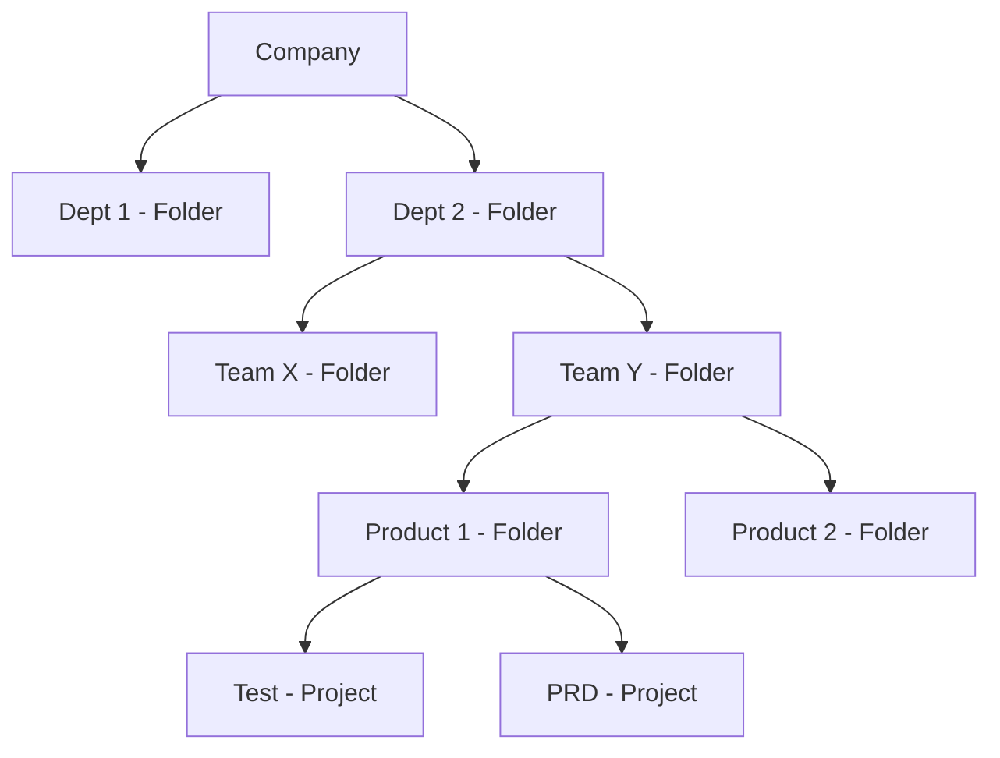

# Preparing for Your Associate Cloud Engineer Journey
This course helps you structure your preparation for the Associate Cloud Engineer exam. You will learn about the Google Cloud domains covered by the exam and how to create a study plan to improve your domain knowledge.

## Introduction
**What is the role of an Associate Cloud Engineer?**

An Associate Cloud Engineer deploys and secures applications and infrastructure, monitors operations of multiple projects, and maintains enterprise solutions to ensure that they meet target performance metrics. This individual has experience working with public clouds and on-premises solutions. They are able to use Google Cloud console and the CLI to perform common platform-based tasks to maintain and scale one or more deployed solutions that leverage Google-managed or self-managed services on GCP.

**Why become a Google Cloud Certified Associate Cloud Engineer?**
- industry recognition;
- validates your technical expertise;
- starting point to take your career to the next level.

The associate cloud engineer certification is valuable on its own, and can also be used as a starting point on the path to professional certification.

**What is the difference between associate and professional certification?**

Associate Cloud Engineering:
1. Technical requirements: Build, Deploy and Manage

Professional Level Certification:
1. Business requirements: Design, Plan, Ensure feasibility, Optimize
1. Technical requirements: Build, Deploy and Manage

## Setting Up a Cloud Solution Environment
Module 1 - Implementing the basic cloud infrastructure for the organization:
1. Setting up cloud projects and accounts;
    - Establishing a resource hierarchy
    - Implemeting organizational policies to the resource hierarchy
    - Managing projects and quotas
    - Managing users and groups in Cloud Identity (manually and automated)
    - Applying access management
    - Enabling APIs within projects
    - Provisioning and setting up products in GC Observability
1. Managing billing configuration
    - Creating one or more billing accounts
    - Linking projects to a billing account
    - Establishing billing budgets and alerts
    - Setting up billing exports
1. Installing and configuring the CLI

Setting up products in Google Cloud Observability: provide metrics and logging services for all services, resources and projects.

To monitor metrics from multiple project, you set up project scoping. If Cymbal Superstore’s Operations department decides to monitor metrics across all three supply chain projects in the staging environment project, you will set staging as a scoping project and then add dev and production as monitored projects.

Interacting with Google Cloud:
- **Web user interface**: Google Cloud Console
- **Command-line interface**: Cloud SDK  and Cloud Shell
- **iOS and Android**: Cloud Mobile app
- **Custom applications**: REST-based API

### Resource Hierarchy
1. Organization sits at the top of the Google Cloud resource hierarchy
1. Folders are optional and come between organization and projects
1. Projects
1. Resources

When you give a user, group, or service account a role on a specific element of the resource hierarchy, the resulting policy applies to the element you chose, as well as to elements below it in the hierarchy.

### Managing users and groups in Cloud Identity (manually and automated)
1. Users should be added to groups **and groups assigned roles** to simplify permissions management.
    - Avoid to assign roles to an individual user
1. Best practice is to manage role assignment by groups not by individual users.
1. You assign members to roles through an IAM policy. Roles are combinations of permissions needed for a role.
1. Members can be a Google account, a service account, a Google group, a Google Workspace domain, a cloud Identity domain, all authenticated users, and all users.
1. A service account is an account for an application instead of an end user.

### Applying access management
IAM (Identity and Access Management):
1. Who
1. Can do what
1. on which resource

### Ways to Interact with the services
Cloud SDK:
- is a set of tools that you can use to manage resources and applications hosted on Google Cloud.
- provides a local CLI environment
- (gcloud, gcloud storage, and bq)

Cloud Shell:
- It provides a cloud-based CLI environment
- is a Debian-based virtual machine with a persistent 5-GB home directory
- Built-in authorization for access to projects and resources

The gcloud tool lets you manage development workflow and Google Cloud resources
in a terminal window. You can run gcloud commands by installing the Cloud SDK, which includes the cloud tool. You use it by opening a terminal window on your own computer.

Client libraries are also provided by the Cloud SDK. They provide access to API’s for access to services, called application API’s, and Admin API’s which allow you to automate resource management tasks.

### Documentation to review:
Setting up cloud projects and accounts
- [IAM Overview](!https://cloud.google.com/iam/docs/overview)
- [Cloud Platform Resource hierarchy](!https://cloud.google.com/resource-manager/docs/cloud-platform-resource-hierarchy)
- [Understanding roles](!https://cloud.google.com/iam/docs/understanding-roles)

Managing billing configuration
- [Managing billing account](!https://cloud.google.com/billing/docs/how-to/manage-billing-account)
- [Budgets](!https://cloud.google.com/billing/docs/how-to/budgets)

Installing and configuring the command line interface (CLI), specifically the Cloud SDK
- [Ways to Interact with the services](!https://cloud.google.com/docs/overview#ways_to_interact_with_the_services)
- [Initializing with SDK](!https://cloud.google.com/sdk/docs/initializing)
- [Managing gcloud CLI components](!https://cloud.google.com/sdk/docs/components)
- [Gcloud Reference](!https://cloud.google.com/sdk/gcloud/reference)
- [BQ Guide](!https://cloud.google.com/bigquery/docs/bq-command-line-tool)
- [Gcloud Storage Reference](!https://cloud.google.com/sdk/gcloud/reference/storage)

## Planning and Configuring a Cloud Solution
After implementing the basic cloud infrastructure (Previous section), the next steps are:
- Planning and estimating Google Cloud princing using the Pricing Calculator
- Planning and configuring compute resources
- Planning and configuring data storage options
- Planning and configuring nesources

There are some common questions to ask while you are analyzing the data needs.
1. Are your data processing needs transactional or analytical?
1. Do you need to query your data in a relational way?
1. Do you want large groups of related data to be returned through 
a non-relational get operation?
1. Does it require access to the internet, or do you just need to provide connectivity to internal components on your private network?
1. Are you going to configure the connectivity of multiple application servers by load balancing incoming traffic across them?
1. How are you going to protect your app against network or system outages?

### Planning and estimating Google Cloud princing using the Pricing Calculator
The Pricing Calculator is a multi-section form that lets you estimate the costs of different cloud services based on how you are going to use and configure them.

Obs:
- *Egress is the amount of data read from the bucket and is also chargeable.*

### Planning and configuring compute resources
A cloud architect will typically design a cloud solution. As an Associate Cloud Engineer, it’s important for you to be able to plan and configure compute resources to align with Google recommended practices. That means you should be comfortable with the different compute options available in Google Cloud and when to use each one.

Considerations include:
- Selecting appropriate compute choices for a given workload
    - (e.g., Compute Engine, Google Kubernetes Engine, Cloud Run, Cloud Functions)
- Using preemptible VMs and custom machine types as appropriate

There are five distinct ways to interact with compute resources in Google Cloud. They can be divided into server-based services (IaaS), where manage and pay for infrastructure, and serverless options (PaaS), where you just pay for execution time. The options are:
- Infraestructure as a Service (IaaS):
    - Compute Engine
    - GKE - Google Kubernetes Engine
- Platform as a Service (PaaS):
    - App Engine
    - Cloud Run
    - Cloud Functions

PaaS options, you focus on code and Google manages the underlying hardware and OSs for you.

When you need to use:
- Compute Engine: 
    - Complete controle,
    - Ability to make OS level changes, 
    - To be able to move to the cloud without rewriting the code
    - To use custom VM images
- GKE
    - No dependencies on a specific OS
    - Increased velocity and operability
    - To manage containers in production
- App Engine
    - To just focus on writting code
    - Developer velocity
    - Minimize operational overhead
- Cloud Run
    - Scales to meet demand
    - Pay for what you use
    - Supports API endpoints
- Cloud Functions
    - For event-driver workloads
    - Scales to meet demand
    - Minimal configuration

Typical Uses Cases:
- Compute Engine: 
    - Any workload requiring a specific OS or configuration
    - On premises software that you want to run in the cloud
- GKE
    - Containerized workloads
    - Cloud-native distributed systems
    - Hybrid applications
- App Engine
    - Web sites
    - Apps
    - Gaming back ends
    - IoT applications
- Cloud Run
    - Web frameworks
    - Microservices
- Cloud Functions
    - Statiscal analysis
    - Image trumbnail generation
    - Post a comment to a Slack channel after a GitHub commit

App Engine has two environments: standard and flexible. Standard provides a sandbox environment and totally abstracts the infrastructure for you. The flexible environment gives you more choices for deploying your app. It supports more languages, supports different runtimes, and lets you load dependencies you need in the underlying architecture.

Cloud Run, which is also serverless, enables you to run stateless containers via web requests and Google Cloud service events. Cloud Run operates using Knative, an open-source, Kubernetes-based platform. It builds, deploys, and manages modern serverless workloads. Cloud Run gives you the choice of running your containers either fully-managed or in your own GKE cluster.

### Planning and configuring data storage options
Along with compute resources, an Associate Cloud Engineer needs to be able to plan and configure data storage in Google Cloud. that requires understanding of the different product choices (Cloud SQL, BigQuery, Firestore, Spanner, Bigtable) and storage options (Zonal persistent disk, regional balanced persistent disk, standard, nearline, coldline, archive), and how to make recommended choices for a given use case.

Differentiate between relational databases and data warehouses:
- relational databases can be transactional, while data warehouses are analytical and based on historical data.

Product choices:
- Cloud SQL: It is is optimized for **transactional** reads and writes. It is a managed version of databases you can implement on-premises,
- BigQuery: It is Google Cloud’s implementation of a modern data warehouse. BigQuery analyzes historical data and uses a SQL query engine. It does have a native storage format but can also query external data where it resides. *Keep in mind its native storage format is not a good solution for a backend store for an application.*
- Firestore: It is a NoSQL **document database** used to define entities with attributes. It is not a good choice for the analysis of historical data.
- Spanner: It is an SQL-compatible relational database, but it is not built for analyzing historical data. Spanner is horizontally scalable and globally available.
- Bigtable: It is based on column families where rows of data are referenced by a key that combines commonly queried columns. Related columns can additionally be organized into column families such as username and address.

Comparing Data Storage and Database Options
1. Warehouse
    - Product: BigQuery
        - Good for: Analytics, dashboards
1. Relational
    - Product: Cloud SQL
        - Good for: transactional, web frameworks (such as CMS, eCommerce, customer orders, user credentials)
    - Product: Spanner
        - Good for: **global** transactions, automatic multi-site replication, failover. Large-scale database applications (> 2TiB)
1. Non-relational:
    - Product: Firestone
        - Good for: Hierarchical, mobile, web, storing, syncing, and querying data.
    - Product: BigTable
        - Good for: Heavy read/write, events, flat data, **analytical data**
1. Object:
    - Product: Cloud Storage
        - Good for: Binary or object data. Such as: Images, media serving.

Storage classes:
- **Archive storage** is the best choice for data that you plan to access less than once a year.
    - Use when: Data archiving, online backup, and disaster recovery.
- **Coldline** is good for storing data accessed only every 90 days.
    - Use when: Very infrequently accessed data - ie, once a year. Typically this is for disaster
recovery, or for financial data that has to be kept for a certain length of time to meet regulatory needs.
- **Nearline** is good for storing data accessed only every 30 days.
    - Use when: deal for back-up and serving long-tail multimedia content.
- **Standard storage** is best for data that is frequently accessed ("hot" data) and/or stored for only brief periods of time. In addition, co-locating your resources by selecting the regional option maximizes the performance for data-intensive computations and can reduce network charges.
    - Use when: "hot" data

OLTP and OLAP:
Two common workloads required in a modern business environment are transactional workloads and analytical workloads.

Transactional workloads are optimized for more writes and updates than reads. Transactional means either all parts of an update happen or none of them do. For example, think of the importance of making sure deposits and withdrawals are recorded in a financial system. Both of these are part of one transaction. Relational database services used to support transactional systems in Google Cloud include Cloud SQL and Spanner.

The other type of workload is analytical. It is based on querying historical data that
doesn’t change often, and is optimized for writes. BigQuery is a good option for this kind of workload.

### Planning and configuring network resources

Meu ponto fraco

Together with compute and storage decisions, an associate cloud architect should be able to plan and configure network resources in Google Cloud - including load balancing, resource locations, and Cloud DNS. Tasks include:
- Differentiating load balancing options. E.g: load balancing options to the appropriate TCP layer
- Identifying resource locations in a network for availability. E.g.: List regional load balancing options and when to use each one: regional, regional internal (for use inside a VPC).
- Configuring Cloud DNS

### Documentation to review:
Planning and estimating Google Cloud princing using the Pricing Calculator
- [Choosing the Right Compute option in GCP](!https://cloud.google.com/blog/products/compute/choosing-the-right-compute-option-in-gcp-a-decision-tree)

Planning and configuring compute resources
- [Resource hosting options](!https://cloud.google.com/hosting-options)
- [Compute Engine overview](!https://cloud.google.com/compute/docs/overview)
- [Choosing a compute option](!https://cloud.google.com/docs/choosing-a-compute-option)

Planning and configuring data storage options
- [Google Cloud online storage products](!https://cloud.google.com/products/storage?hl=en)
- [Google Cloud Storage Classes](!https://cloud.google.com/storage/docs/storage-classes)

Planning and configuring network resources

## Deploying and Implementing a Cloud Solution

## Ensuring Successful Operation of a Cloud Solution

## Configuring Access and Security

