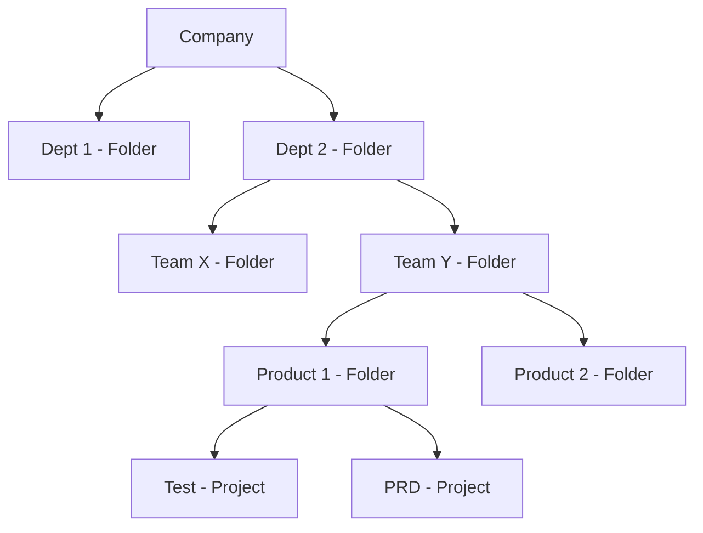
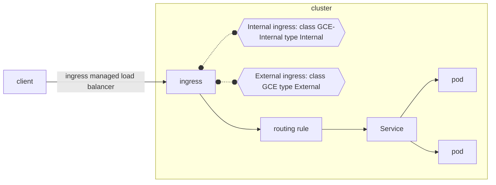
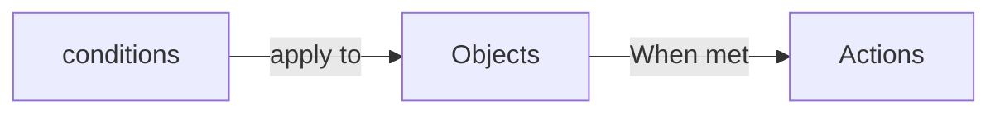

# Preparing for Your Associate Cloud Engineer Journey
This course helps you structure your preparation for the Associate Cloud Engineer exam. You will learn about the Google Cloud domains covered by the exam and how to create a study plan to improve your domain knowledge.

## Introduction
**What is the role of an Associate Cloud Engineer?**

An Associate Cloud Engineer deploys and secures applications and infrastructure, monitors operations of multiple projects, and maintains enterprise solutions to ensure that they meet target performance metrics. This individual has experience working with public clouds and on-premises solutions. They are able to use Google Cloud console and the CLI to perform common platform-based tasks to maintain and scale one or more deployed solutions that leverage Google-managed or self-managed services on GCP.


**Why become a Google Cloud Certified Associate Cloud Engineer?**
- industry recognition;
- validates your technical expertise;
- starting point to take your career to the next level.

The associate cloud engineer certification is valuable on its own, and can also be used as a starting point on the path to professional certification.

**What is the difference between associate and professional certification?**

Associate Cloud Engineering:
1. Technical requirements: Build, Deploy and Manage

Professional Level Certification:
1. Business requirements: Design, Plan, Ensure feasibility, Optimize
1. Technical requirements: Build, Deploy and Manage


## Setting Up a Cloud Solution Environment
Module 1 - Implementing the basic cloud infrastructure for the organization:
1. Setting up cloud projects and accounts;
    - Establishing a resource hierarchy
    - Implemeting organizational policies to the resource hierarchy
    - Managing projects and quotas
    - Managing users and groups in Cloud Identity (manually and automated)
    - Applying access management
    - Enabling APIs within projects
    - Provisioning and setting up products in GC Observability
1. Managing billing configuration
    - Creating one or more billing accounts
    - Linking projects to a billing account
    - Establishing billing budgets and alerts
    - Setting up billing exports
1. Installing and configuring the CLI


Setting up products in Google Cloud Observability: provide metrics and logging services for all services, resources and projects.

To monitor metrics from multiple project, you set up project scoping. If Cymbal Superstore’s Operations department decides to monitor metrics across all three supply chain projects in the staging environment project, you will set staging as a scoping project and then add dev and production as monitored projects.

Interacting with Google Cloud:
- **Web user interface**: Google Cloud Console
- **Command-line interface**: Cloud SDK  and Cloud Shell
- **iOS and Android**: Cloud Mobile app
- **Custom applications**: REST-based API

### Resource Hierarchy
1. Organization sits at the top of the Google Cloud resource hierarchy
1. Folders are optional and come between organization and projects
1. Projects
1. Resources

When you give a user, group, or service account a role on a specific element of the resource hierarchy, the resulting policy applies to the element you chose, as well as to elements below it in the hierarchy.



### Managing users and groups in Cloud Identity (manually and automated)
1. Users should be added to groups **and groups assigned roles** to simplify permissions management.
    - Avoid to assign roles to an individual user
1. Best practice is to manage role assignment by groups not by individual users.
1. You assign members to roles through an IAM policy. Roles are combinations of permissions needed for a role.
1. Members can be a Google account, a service account, a Google group, a Google Workspace domain, a cloud Identity domain, all authenticated users, and all users.
1. A service account is an account for an application instead of an end user.

### Applying access management
IAM (Identity and Access Management):
1. Who
1. Can do what
1. on which resource

### Ways to Interact with the services
Cloud SDK:
- is a set of tools that you can use to manage resources and applications hosted on Google Cloud.
- provides a local CLI environment
- (gcloud, gcloud storage, and bq)

Cloud Shell:
- It provides a cloud-based CLI environment
- is a Debian-based virtual machine with a persistent 5-GB home directory
- Built-in authorization for access to projects and resources


The gcloud tool lets you manage development workflow and Google Cloud resources
in a terminal window. You can run gcloud commands by installing the Cloud SDK, which includes the cloud tool. You use it by opening a terminal window on your own computer.


Client libraries are also provided by the Cloud SDK. They provide access to API’s for access to services, called application API’s, and Admin API’s which allow you to automate resource management tasks.

### Documentation to review:
Setting up cloud projects and accounts
- [IAM Overview](!https://cloud.google.com/iam/docs/overview)
- [Cloud Platform Resource hierarchy](!https://cloud.google.com/resource-manager/docs/cloud-platform-resource-hierarchy)
- [Understanding roles](!https://cloud.google.com/iam/docs/understanding-roles)

Managing billing configuration
- [Managing billing account](!https://cloud.google.com/billing/docs/how-to/manage-billing-account)
- [Budgets](!https://cloud.google.com/billing/docs/how-to/budgets)

Installing and configuring the command line interface (CLI), specifically the Cloud SDK
- [Ways to Interact with the services](!https://cloud.google.com/docs/overview#ways_to_interact_with_the_services)
- [Initializing with SDK](!https://cloud.google.com/sdk/docs/initializing)
- [Managing gcloud CLI components](!https://cloud.google.com/sdk/docs/components)
- [Gcloud Reference](!https://cloud.google.com/sdk/gcloud/reference)
- [BQ Guide](!https://cloud.google.com/bigquery/docs/bq-command-line-tool)
- [Gcloud Storage Reference](!https://cloud.google.com/sdk/gcloud/reference/storage)


## Planning and Configuring a Cloud Solution
After implementing the basic cloud infrastructure (Previous section), the next steps are:
- Planning and estimating Google Cloud princing using the Pricing Calculator
- Planning and configuring compute resources
- Planning and configuring data storage options
- Planning and configuring nesources

There are some common questions to ask while you are analyzing the data needs.
1. Are your data processing needs transactional or analytical?
1. Do you need to query your data in a relational way?
1. Do you want large groups of related data to be returned through 
a non-relational get operation?
1. Does it require access to the internet, or do you just need to provide connectivity to internal components on your private network?
1. Are you going to configure the connectivity of multiple application servers by load balancing incoming traffic across them?
1. How are you going to protect your app against network or system outages?


### Planning and estimating Google Cloud princing using the Pricing Calculator
The Pricing Calculator is a multi-section form that lets you estimate the costs of different cloud services based on how you are going to use and configure them.

Obs:
- *Egress is the amount of data read from the bucket and is also chargeable.*

### Planning and configuring compute resources
A cloud architect will typically design a cloud solution. As an Associate Cloud Engineer, it’s important for you to be able to plan and configure compute resources to align with Google recommended practices. That means you should be comfortable with the different compute options available in Google Cloud and when to use each one.


Considerations include:
- Selecting appropriate compute choices for a given workload
    - (e.g., Compute Engine, Google Kubernetes Engine, Cloud Run, Cloud Functions)
- Using preemptible VMs and custom machine types as appropriate


There are five distinct ways to interact with compute resources in Google Cloud. They can be divided into server-based services (IaaS), where manage and pay for infrastructure, and serverless options (PaaS), where you just pay for execution time. The options are:
- Infraestructure as a Service (IaaS):
    - Compute Engine
    - GKE - Google Kubernetes Engine
- Platform as a Service (PaaS):
    - App Engine
    - Cloud Run
    - Cloud Functions


PaaS options, you focus on code and Google manages the underlying hardware and OSs for you.


When you need to use:
- Compute Engine: 
    - Complete controle,
    - Ability to make OS level changes, 
    - To be able to move to the cloud without rewriting the code
    - To use custom VM images
- GKE
    - No dependencies on a specific OS
    - Increased velocity and operability
    - To manage containers in production
- App Engine
    - To just focus on writting code
    - Developer velocity
    - Minimize operational overhead
- Cloud Run
    - Scales to meet demand
    - Pay for what you use
    - Supports API endpoints
- Cloud Functions
    - For event-driver workloads
    - Scales to meet demand
    - Minimal configuration

Typical Uses Cases:
- Compute Engine: 
    - Any workload requiring a specific OS or configuration
    - On premises software that you want to run in the cloud
- GKE
    - Containerized workloads
    - Cloud-native distributed systems
    - Hybrid applications
- App Engine
    - Web sites
    - Apps
    - Gaming back ends
    - IoT applications
- Cloud Run
    - Web frameworks
    - Microservices
- Cloud Functions
    - Statiscal analysis
    - Image trumbnail generation
    - Post a comment to a Slack channel after a GitHub commit


App Engine has two environments: standard and flexible. Standard provides a sandbox environment and totally abstracts the infrastructure for you. The flexible environment gives you more choices for deploying your app. It supports more languages, supports different runtimes, and lets you load dependencies you need in the underlying architecture.


Cloud Run, which is also serverless, enables you to run stateless containers via web requests and Google Cloud service events. Cloud Run operates using Knative, an open-source, Kubernetes-based platform. It builds, deploys, and manages modern serverless workloads. Cloud Run gives you the choice of running your containers either fully-managed or in your own GKE cluster.

### Planning and configuring data storage options
Along with compute resources, an Associate Cloud Engineer needs to be able to plan and configure data storage in Google Cloud. that requires understanding of the different product choices (Cloud SQL, BigQuery, Firestore, Spanner, Bigtable) and storage options (Zonal persistent disk, regional balanced persistent disk, standard, nearline, coldline, archive), and how to make recommended choices for a given use case.

Differentiate between relational databases and data warehouses:
- relational databases can be transactional, while data warehouses are analytical and based on historical data.

Product choices:
- Cloud SQL: It is is optimized for **transactional** reads and writes. It is a managed version of databases you can implement on-premises,
- BigQuery: It is Google Cloud’s implementation of a modern data warehouse. BigQuery analyzes historical data and uses a SQL query engine. It does have a native storage format but can also query external data where it resides. *Keep in mind its native storage format is not a good solution for a backend store for an application.*
- Firestore: It is a NoSQL **document database** used to define entities with attributes. It is not a good choice for the analysis of historical data.
- Spanner: It is an SQL-compatible relational database, but it is not built for analyzing historical data. Spanner is horizontally scalable and globally available.
- Bigtable: It is based on column families where rows of data are referenced by a key that combines commonly queried columns. Related columns can additionally be organized into column families such as username and address.

Comparing Data Storage and Database Options
1. Warehouse
    - Product: BigQuery
        - Good for: Analytics, dashboards
1. Relational
    - Product: Cloud SQL
        - Good for: transactional, web frameworks (such as CMS, eCommerce, customer orders, user credentials)
    - Product: Spanner
        - Good for: **global** transactions, automatic multi-site replication, failover. Large-scale database applications (> 2TiB)
1. Non-relational:
    - Product: Firestone
        - Good for: Hierarchical, mobile, web, storing, syncing, and querying data.
    - Product: BigTable
        - Good for: Heavy read/write, events, flat data, **analytical data**
1. Object:
    - Product: Cloud Storage
        - Good for: Binary or object data. Such as: Images, media serving.

Storage classes:
- **Archive storage** is the best choice for data that you plan to access less than once a year.
    - Use when: Data archiving, online backup, and disaster recovery.
- **Coldline** is good for storing data accessed only every 90 days.
    - Use when: Very infrequently accessed data - ie, once a year. Typically this is for disaster
recovery, or for financial data that has to be kept for a certain length of time to meet regulatory needs.
- **Nearline** is good for storing data accessed only every 30 days.
    - Use when: deal for back-up and serving long-tail multimedia content.
- **Standard storage** is best for data that is frequently accessed ("hot" data) and/or stored for only brief periods of time. In addition, co-locating your resources by selecting the regional option maximizes the performance for data-intensive computations and can reduce network charges.
    - Use when: "hot" data


OLTP and OLAP:
Two common workloads required in a modern business environment are transactional workloads and analytical workloads.

Transactional workloads are optimized for more writes and updates than reads. Transactional means either all parts of an update happen or none of them do. For example, think of the importance of making sure deposits and withdrawals are recorded in a financial system. Both of these are part of one transaction. Relational database services used to support transactional systems in Google Cloud include Cloud SQL and Spanner.

The other type of workload is analytical. It is based on querying historical data that
doesn’t change often, and is optimized for writes. BigQuery is a good option for this kind of workload.

### Planning and configuring network resources

Meu ponto fraco


Together with compute and storage decisions, an associate cloud architect should be able to plan and configure network resources in Google Cloud - including load balancing, resource locations, and Cloud DNS. Tasks include:
- Differentiating load balancing options. E.g: load balancing options to the appropriate TCP layer
- Identifying resource locations in a network for availability. E.g.: List regional load balancing options and when to use each one: regional, regional internal (for use inside a VPC).
- Configuring Cloud DNS


#### Differentiating load balancing options
An important consideration when designing an application accessed by end users is load balancing.


Load balancing takes user requests and distributes them across multiple instances of your application. This helps to keep your application from experiencing performance issues if there is a spike in user activity.


Load balancing options available in Google Cloud can be **divided into** those that operate at **layer 7 (application)** of the OSI model and those that operate at **layer 4** of the stack.
The http(s) and file transfer protocol (ftp) load balancers live at Layer 7 of the OSI model.

Layer 4 of the OSI model encapsulates host-to-host communication in both the Transport and Network levels.  TCP/UDP, SSL and network load balancers reside at Layer 4 of the OSI model.


Google cloud offers both internal and external load balancers.
- The external load balancers include https, SSL, and TCP load balancers.
- Internal load balancers include TCP/UDP, http(s), and network pass-through load balancers.


In Google Cloud, load balancers can be be proxied or pass-through.
- Proxied load balancers terminate connections and proxy them to new connections internally.
- Pass-through load balancers pass the connections directly to the backends.

Load balancing options:
- Global HTTP(S)
    - Layer 7 load balancing based on load. 
    - Can route different URLs to different backends.
    - Traffic type: HTTP or HTTPS
    - Global, IPv4, IPv6
    - External ports: HTTP on 80 or 8080; HTTPs on 443.
- Global SSL Proxy
    - Layer 4 load balancing of non-HTTPS SSL traffic based on load.
    - Supported on specific port numbers.
    - Traffic type: TCP with SSL offload
    - Global, IPv4, IPv6
- Global TCP Proxy
    - Layer 4 load balancing of non-SSL TCP traffic
    - Supported on specific port numbers
    - Traffic type: TCP without SSL offload (Does not preserve client IP address)
    - Global, IPv4, IPv6
- Regional
    - Load balancing of any traffic (TCP, UDP)
    - Support on **any** port number
- Regional internal
    - Load balancing of traffic inside a VPC
    - User for the internal tiers of multi-tier applications
    - It can be TCP/UDP or HTTP/HTTPS traffic type


When load balancing in a particular region, external connectivity to your front ends can happen through an external http(s) load balancer with the proper forwarding rules and the standard networking tier. For connectivity internal to your defined vpc network, you should use the internal https and internal TCP/UDP load balancing options.


Exercises notes:
- **Premium** external https load balancer is **global** and more expensive;
- https load balancer is proxied, not pass-through;
- TCP/UDP is a pass-through balancer;
- **Premium** tier SSL is **global** and is not the proper solution between web and backend within a region.
- SSL load balancer is not a good solution for web front ends. For a web frontend, you should use an HTTP/S load balancer (layer 7) whenever possible.
- A standard tier proxied external load balancer is effectively a regional resource.
- A regional internal load balancer doesn’t require external IPs and is more secure.


### Documentation to review:
Planning and estimating Google Cloud princing using the Pricing Calculator
- [Choosing the Right Compute option in GCP](!https://cloud.google.com/blog/products/compute/choosing-the-right-compute-option-in-gcp-a-decision-tree)

Planning and configuring compute resources
- [Resource hosting options](!https://cloud.google.com/hosting-options)
- [Compute Engine overview](!https://cloud.google.com/compute/docs/overview)
- [Choosing a compute option](!https://cloud.google.com/docs/choosing-a-compute-option)

Planning and configuring data storage options
- [Google Cloud online storage products](!https://cloud.google.com/products/storage?hl=en)
- [Google Cloud Storage Classes](!https://cloud.google.com/storage/docs/storage-classes)

Planning and configuring network resources
- [Cloud Load Balancing overview](!https://cloud.google.com/load-balancing/docs/load-balancing-overview)


## Deploying and Implementing a Cloud Solution
Deploying and implementing:
- Compute Engine resources
- GKE resources
- Cloud Run and Cloud Functions resources
- Data solutions
- Networking resources
- Cloud Marketplace
- Implementing resources via infrastructure as code

Understanding availability, concurrency, connectivity and access options for these services are keys to success as you deploy them to support your needs.

### Compute Engine
Deploying Compute Engine resources can include a range of tasks such as:
- Lauching compute instances using Cloud Console and Cloud SDK;
- Creating identical managed groups of instances based on an image template;
- Generating/uploading a custom SSH key for instances;
- Installing and configuring the Cloud Monitoring and Logging Agent. It allows to track performance and make changes when needed;
- Assessing compute quotas and requesting increases.


Compute Engine allows you to pick the amount of **memory and CPU** from predefined machine types. Machine types are divided into:
- standard;
- high memory;
- high cpu;
- memory-optimized;
- compute-optimized;
- shared-core categories.
- Custom.

If you need **GPU** support for a compute-heavy workload, you can choose to attach GPUs to certain machine types. You can only use GPUs with general-purpose N1 VMs or accelerator-optimized A2 VMs. Availability of these machine types varies by zone, so make sure you pick a zone that has GPU capability.

**Storage options** for your instances include:
- regional persistent disks;
- zonal persistent disks;
- and local SSD.


Regional persistent disks share replicas of the physical disks across two zones, so
you are protected from a single zone outage. Each persistent disk references data distributed across several physical disks.

**Disk types** you can attach to your virtual machine include:
- standard (HDD);
- SSD;
- or local SSD.

Balanced SSD gives you higher I/O than standard HDD, but less cost and I/O than fully capable SSD disks. Local SDDs provide a very high I/O since they are physically connected to the server your VM is running on.

When you create a virtual machine instance in the console it uses balanced SSD, while when you create one via a gcloud command, it uses standard HDD.

Summary of disk options:
- Persistent disk HDD:
    - Data redundancy, Encryption at rest, Snapshotting, Bootable
    - Use case: General, bulk file storage
- Persistent disk SSD
    - Data redundancy, Encryption at rest, Snapshotting, Bootable
    - Use case: Very random IOPS
- Local SSD disk:
    - Encryption at rest.
    - Use case: High IOPS and low latency.
- RAM disk:
    - Use case: low latency and risk of data loss.


The **Managed instance groups (MIGs)** can be used to deploy identical instances based on instance template. The instance group can be resized and it is typically used with autoscaler. Finally, a Manager ensures all instances are running.


A Managed Instance Groups ensures availability by keeping VM instances running. If a VM fails or stops, the MIG recreates it based on the instance template. You can make your MIG health checks application-based, which looks for an expected response from your application. The MIG will automatically recreate VMs that are not responding correctly. Another availability feature is spreading load across multiple zones using a regional MIG. Finally, you can use a load balancer to evenly distribute traffic across all instances in the group.


When it comes time to update software, automated updates lets you define how you will upgrade the instances in a group. You can specify how many resources to use and how many instances can be unavailable at the same time. Available update scenarios include rolling updates and canary updates. Rolling updates define how you want all instances eventually upgraded to the new template. Canary updates let you specify a certain number of instances to upgrade for testing purposes.


Question 1: Migrate the MySQL database with User-Defined Functions (UDFs) in the most timely and economical way. Notes about the question below.
- Find a MySQL machine image in Cloud Marketplace meets the requirements but is not the most timely way to implement the solution because it requires additional manual configuration;
- Implementing a database instance using Cloud SQL is incorrect because it does not support UDFs.
- Use gcloud to implement a Compute Engine instance with an E2-standard type is incorrect because E2 is a cost-optimized Machine type. 
- Configure a Compute Engine with an N2 Machine type, install MySQL and restore the data to the new instance is correct because N2 is balanced machine type, which is recommended for medium-large databases.


Question 2: Updating the OS of the instances in an automated way using minimal resources. Notes about the question below.
- Create a new instance template, then click Update VMs. Set the update type to PROACTIVE. Click Start. It is the right alternative because this institutes a rolling update automatically, which minimizes resources as requested.
- Set update type to Opportunistic is incorrect because updates are not interactive.
- Set max surge to 5 is incorrect because it creates 5 new machines at a time and it does not use minimal resources.


### Google Kubernetes Engine resources
As an Associate Cloud Engineer, you should be comfortable with the Kubernetes CLI, kubectl, and the steps to deploy clusters and applications to GKE. You’ll also need to configure monitoring and logging in GKE. In other words, the tasks include:
- Installing and configuring the command line interface (CLI) for Kubernetes (kubectl);
- Deploying a Google Kubernetes Engine cluster with different configurations including AutoPilot, regional clusters, private clusters, etc.;
- Deploying a containerized application to Google Kubernetes Engine;
- Configuring Google Kubernetes Engine monitoring and logging.

Basic concepts:
- A cluster deploys containers on a set of nodes.
- Nodes are VMs (Compute Engine instances).


GKE has to modes to choose from: **autopilot mode and standard mode**. Autopilot is fully-provisioned and managed. You are charged according to the resources pods use as you deploy and replicate them based on the pod spec. Standard mode provides you flexibility to define and manage the cluster structure yourself.


In a GKE cluster, availability deals with both the control plane and the distribution of your nodes. A zonal cluster has a single control plane in a single zone. You can distribute the nodes of a zonal cluster across multiple zones, providing node availability in case of a node outage. A regional cluster, on the other hand, has multiple replicas of the control plane in multiple zones with a given region. Nodes in a regional cluster are replicated across three zones, though you can change this behavior as you add new node pools.


Routing between pods (**Network routing**) in GKE can be accomplished using alias IPs or Google Cloud Routes. The first option is also known as a VPC-native cluster, and the second one is called a routes-based cluster.


**Network Isolation**: Public GKE networks let you set up routing from public networks toyour cluster. Private networks use internal addresses for pods and nodes and are isolated from public networks.


Question 3: A need to build a new cloud app using a small Kubernetes cluster for the pilot that should only be available to the development team and does not need to be highly available. Additionally, the developers also need the ability to change the cluster architecture. Notes about the question below.
- The correct ansewer: Implement a private standard zonal cluster in us-central1-a with a default pool and an Ubuntu image.
- Standard clusters can be zonal and the default pool provides nodes used by the cluster.
- Autopilot clusters are regional. They are managed at the pod level. Consequently, it doesn’t support Ubuntu image types.
- The container-optimized image that supports autopilot type does not support custom packages.


### Cloud Run and Cloud Function resources
An Associate Cloud Engineer should be able to deploy and implement serverless solutions. Also, differentiate among serverless options including App Engine standard and flexible environment, and Cloud Run. Other tasks include:
- Deploying an application and updating scaling configuration, versions, and traffic splitting
- Deploying an application that receives Google Cloud events (for example, Pub/Sub events, Cloud Storage object change notification events)
- Describe event function as a service capabilities of Cloud Functions.


**Cloud Run** provides a service to manage containers in a serverless way. A service is a regional resource that is replicated in multiple zones and exposed as an endpoint. 
Underlying infrastructure scales automatically based on incoming requests. If there are no requests coming in it can scale to zero to save you money.


Changes to containers or environment settings create new revisions. Revisions can be rolled out in a way that supports canary testing by splitting traffic according to your specifications. 


Cloud Run is built using an open source initiative called knative. It can use system libraries and tools made available to the container environment. It has a timeout of 60 minutes for longer running requests. Cloud Run can send multiple concurrent requests to each container instance, improving latency, and saving costs for large volumes of incoming traffic.


**App Engine** has two management environments: standard and flexible.


In the standard environment, apps run in a sandbox using a specific language runtime. Standard environment is good for rapid scaling. It is limited to specific languages. It can scale to 0 when there is no incoming traffic. It starts up in seconds. In the standard environment you are not allowed to make changes to the runtime.

In contrast to the standard environment, App Engine flexible runs in Docker containers in Compute Engine VMs. Flexible supports more programming languages. It can use native code and you can Access and manage the underlying Compute Engine resource base. App Engine flexible does not scale to 0. Startup is in minutes. Deployment time is in minutes (longer than standard). It does allow you to modify the runtime environment.


Cloud Run Functions It is a fully managed service based on events that happen across your cloud environment, including services and infrastructure. The functions you develop run in response to those events. There are no servers to manage or scaling to configure. The service provides the underlying resources required to execute your function. A trigger sends an https request to an endpoint the service is listening on. This endpoint then responds by deploying and executing the function and returning the results specified in your code. Pricing is based on the number of events,
compute time, and memory required in network ingress/egress. 


Cloud Functions use cases include IoT processing and lightweight ETL. By design, functions you write for use by the Cloud Functions service are stateless. If you need to share and persist data across function runs, you should consider using Datastore or Cloud Storage. 


Each Cloud Function instance handles only one concurrent request at a time. If, while handling a request, another one comes in, Cloud Functions will ask for more instances to be created. This is another reason functions need to be stateless, because they can run on different instances. You can implement minimum instance limits to avoid latency associated with cold starts.


Question 4: quickly deploy a containerized web application; the services will be exposed; Do not want to manage infrastructure; pay when requests are being handled; need support for custom
packages. What technology meets these needs?
- Correct: **Cloud Run** is serverless, exposes your services as an endpoint, and abstracts all infrastructure.
- App Engine flexible environment is incorrect because it does not scale to zero.
- App Engine standard environment is incorrect because does not allow custom packages.
- Cloud Functions is incorrect because it does not deploy containers. It deploys and executes small snippets of code.


Question 5: files being added to a Cloud Storage bucket. Specify a trigger resource pointing to your bucket.
- --trigger-event google.storage.object.finalize


### Data solutions 
There are several different data requirements based on the storage needs of different applications.


As an Associate Cloud Engineer, you’ll need to be able to deploy and implement a wide range of data solutions.

The steps for setting up a Cloud SQL instance are:
1. Create instance;
1. Select database type;
1. Enter name;
1. Enter password for root user;
1. Select proper version (*it cannot be edited!*);
1. Select region and zone (*Can’t be modified!*);
1. Select primary and secondary zone;
1. Config settings: include machine type, private or public ip, storage type, storage capacity, threshold for automated storage increase,...


Question 7: Which gcloud flag argument is required to configure the stated failover capability using gcloud sql instances create?
- Correct: --availability-type. This option allows you to specify zonal or regional availability, with regional providing automatic failover to a standby node in another region.

Question 8: load some slowly changing data into BigQuery. The data arrives hourly in a Cloud Storage bucket. How to implement it minimizing cost and implementing it in fewest steps?
- Implement a bq load command is incorrect because this solution doesn’t cost anything but is more complex than setting up a data transfer.
- Read the data from your bucket by using the BigQuery streaming API is incorrect because the streaming API has pricing associated with it based on how much data is streamed in.
- Create a Cloud Function to push data to BigQuery through a Dataflow pipeline is incorrect because a Dataflow pipeline will incur charges for the resources performing the sink into BigQuery.
- Correct: **Use the BigQuery data transfer service** to schedule a transfer between your bucket and BigQuery. BigQuery transfer service is the simplest process to set up transfers between Cloud Storage and BigQuery. It is encompassed by one command. It is also free.


#### Ways to batch load data into BigQuery
BigQuery offers several ways to load data. The first, and oldest, is loading data in batch. It can be used to load data from csv files, databases, and log files. It is the recommended way to load slowly changing data. There is no charge for batch loads into BigQuery; 


The ways you can implement a batch load in BigQuery include:
1. Create a load job.
1. Use BigQuery Data Transfer Service from Software as a Service products (*This is the simplest approach!*)
1. Use Cloud Composer, a Google Cloud managed version of Apache Airflow.
1. Use the bq command line tool and the cron scheduler on the command line interface.
1. Use BigQuery connectors for big data products such as Spark or Hadoop.


For real-time use cases you can stream data into BigQuery using the Streaming API. Data streamed into BigQuery can be used for querying immediately. The streaming API can be used to track and query application events or log stream information.


The third way to ingest data into BigQuery is to use Dataflow and Apache Beam. These two technologies define a processing pipeline where your source or sink can
be BigQuery. A possible use-case for this is to trigger a Cloud Function when an event happens. The Cloud Function could contain the logic to start an Apache Beam pipeline using a Dataflow runner that would execute transformations required andthen save your data into BigQuery when it is done.


Another way to load data is to execute queries in BigQuery native storage or federated queries on external data and save the results to a table. CTAS (create table as select) is a way to do this using DML as well.


Finally, many third party applications have connectors you can use to get data in to Big Query. You would need to look at the documentation of the product you want to ingest data from.

### Networking resources
Knowing how to connect your cloud resources, services, and users is an important aspect of being an Associate Cloud Engineer.

Virtual Private Cloud (VPC) are part of Google’s software defined network environment. VPCs provide connectivity to Compute Engine instances. They offer internal
TCP/UDP load balancing systems. They allow you to implement Cloud VPN tunnels to communicate with your on-premises network, and they distribute external traffic to backend servers.

Tasks include:
- Creating a VPC with subnets;
- Launching a Compute Engine instance with custom network configuration
- Creating ingress and egress firewall rules for a VPC
- Creating a VPN between a Google VPC and an external network using Cloud VPN
- Creating a load balancer to distribute application network traffic to an application


Question 9: fully control IP ranges and the definition of regional subnets. Which Virtual Private Cloud (VPC) network type allow this?
- Default Project network is incorrect because A project’s default network is an auto mode network that creates one subnet in each Google Cloud region automatically with a predetermined set of IP ranges.
- Auto mode network is incorrect because an auto mode network creates one subnet in each Google Cloud region automatically with a predetermined set of IP ranges.
- An auto mode network converted to a custom network is incorrect because it retains the currently assigned IP addresses and requires additional steps to change subnet characteristics.
- Custom mode network is **correct** because it gives you control over regions that you place your subnets in and lets you specify IP ranges for them as well.


There are two types of network configurations that are available when you decide to create a new VPC.
1. **Auto mode networks** create one subnet in each region automatically. New subnets are added automatically when new regions come on line. IP addresses are created from a predetermined set of address spaces. The default VPC created when you create a project is an auto mode VPC. The benefits of using auto mode include being easy to set up and use and subnets are created in each region. You need to ensure IP ranges do not overlap with on-premise resources.
1. **custom network**: you create and configure the subnets you want and only in the regions you want. If you try to create instances in a region that doesn’t have a subnet defined, you will get an error message. Custom networks are recommended for production environments. Custom networks are a good choice when you don’t need subnets in every region.You can convert an auto mode to a custom network, but not the reverse.

### Cloud Marketplace
Cloud Marketplace keeps you from reinventing the wheel if you have a software stack that you need supported on a Compute Engine VM instance.

Tasks include: 
- Browsing Cloud Marketplace catalog and viewing solution details
- Deploying a Cloud Marketplace solution

### Infrastructure as code
Tasks include:
- Building infrastructure via Cloud Foundation Toolkit templates and implementing best practices;
- Installing and configuring Config Connector in GKE to create, update, delete, and secure resources

Interacting directly with Google cloud console is great, but for repetitive tasks it might be better to be able to implement resources in an automated way. Modern DevOps processes have made declarative resource allocation a reality. Tools like Terraform take the resource requirements you provide via a configuration file. These infrastructure as code systems worry about how these resources are built. You just have to specify what you want built.

Terraform:
- init downloads the latest version
- plan verifies the syntax
- plan outputs a preview of resources.
- Apply sets up resources specified in the terraform config file.


Terraform lifecycle:
1. init
1. plan
1. apply


Terraform is an open source tool for implementing resources in a declarative way. You specify a Terraform config file that describes the resources you want to deploy. Terraform is known as an infrastructure as code service. A benefit of implementing resources in this way is that your configuration files can be source controlled, thus following devops best practices.


In Google Cloud, you store your Terraform config files in a Cloud Storage bucket with object versioning enabled. Cloud Build submits Terraform commands via a YAML file. It needs access to the Cloud Storage bucket where your Terraform config files are stored.

The different files required for implementing Terraform in Google Cloud include:
- Cloudbuild.yaml - build configuration file that contains instructions for Cloud Build
- Backend.tf - stores remote Terraform state information
- Terraform.tfstate - local file that stores Terraform state
- Main.tf - contains the terraform config

Commands ran by Cloud Build include:
- Terraform init - downloads latest version of Terraform provider;
- Terraform plan - verifies syntax, ensures supporting files exist, shows a preview of resources that will be created;
- Terraform apply - sets up requested resources output by the Terraform plan;
- Terraform destroy - destroy all resources in the specified config file.


### Documentation to review:
Deploying and implementing Compute Engine resources
- [Compute Engine Documentation](!https://cloud.google.com/compute/docs/)
- [Basic scenarios for creating managed instance groups](!https://cloud.google.com/compute/docs/instance-groups/creating-groups-of-managed-instances)

Deploying and implementing Google Kubernetes Engine resources
- [Types of Clusters](!https://cloud.google.com/kubernetes-engine/docs/concepts/types-of-clusters)


Deploying and implementing Cloud Run and Cloud Function resources
- [Hosting Options](!https://cloud.google.com/hosting-options)
- [Choose an App Engine environment](!https://cloud.google.com/appengine/docs/the-appengine-environments)
- [What no one tells you about Serverless](!https://cloud.google.com/blog/topics/developers-practitioners/cloud-run-story-serverless-containers)
- [Learn Cloud Functions in a snap](!https://cloud.google.com/blog/topics/developers-practitioners/learn-cloud-functions-snap)
- [Cloud Run Functions](!https://cloud.google.com/functions?hl=en)

Deploying and implementing data solutions
- [Create buckets](!https://cloud.google.com/storage/docs/creating-buckets)
- [Product overview of Cloud Storage](!https://cloud.google.com/storage/docs/introduction)
- [Cloud SQL for MySQL features](!https://cloud.google.com/sql/docs/mysql/features)
- [Create instances](!https://cloud.google.com/sql/docs/mysql/create-instance)
- [How to ingest data into BigQuery so you can analyze it](!https://cloud.google.com/blog/topics/developers-practitioners/bigquery-explained-data-ingestion)
- [Introduction to loading data](!https://cloud.google.com/bigquery/docs/loading-data)

Deploying and implementing networking resources
- [VPC networks](!https://cloud.google.com/vpc/docs/vpc)

Implementing resources via infrastructure as code
- [Terraform Intro](!https://developer.hashicorp.com/terraform/intro)
- [Terraform Google](!https://cloud.google.com/docs/terraform)

## Ensuring Successful Operation of a Cloud Solution
To ensure successful operations, an Associate Cloud Engineer needs the knowledge and skills to manage the resources used in an organization’s cloud solutions.
Managing:
- Compute Engine resources;
- GKE resources;
- Cloud Run resources;
- Storage and database solutions;
- Networking resources;
- Monitoring and logging.

### Managing Compute Engine Resources
As an Associate Cloud Engineer you might be put in charge of implementing and updating instance groups. It also lets you load balance data if needed. Tasks include:
- Managing a single VM instance (e.g., start, stop, edit configuration, or delete an instance)
- Remotely connecting to the instance
- Attaching a GPU to a new instance and installing necessary dependencies
- Viewing current running VM inventory (instance IDs, details)
- Working with snapshots (e.g., create a snapshot from a VM, view snapshots, delete a snapshot)
- Working with images (e.g., create an image from a VM or a snapshot, view images, delete an image)
- Working with instance groups (e.g., set autoscaling parameters, assign instance template, create an instance template, remove instance group)
- Working with management interfaces (e.g., Cloud Console, Cloud Shell, Cloud SDK)


Snapshots are incremental in nature and less expensive than creating full images of a disk. You can only create them for persistent disks. Snapshots are stored across multiple locations with automatic checksums. You schedule them in the console or using the gcloud command line and cron. A Snap shot schedule and its source persistent disk have to be in the same region. You can use snapshots to move VMs. You can’t delete a snapshot that has a schedule associated with it.


How the incremental nature of snapshots works:
1. The first snapshot is full and contains all data on the persistent disk it was run on.
1. Each subsequent snapshot only contains new or modified data since the first snapshot.
1. However, sometimes to clean up resources and cost, a new snapshot might be a full backup.


Implementing an instance group:
1. Create instance template: machine type, boot disk, and Operating System.
1. Configure the instance group: number of instances, autoscalling, and health checks


Managed instance groups help you create and manage groups of identical VM instances. They are based on an instance template that defines how new VMs added to the instance group should be configured. The managed instance group will make sure the number of instances matches what you request, and monitors instances via health checks. If an instance goes down, the managed instance group will start another instance to replace it. Managed instance groups can be zonal or regional. Regional instance groups create instances across multiple zones in a region so your application can still run in case of a zonal outage.


The first step to creating a managed instance group is to create an instance template. An instance template contains information about how to create instances in the group by specifying machine type, boot disk, connectivity, disks, and other details pertinent to your needs. This information is similar to what you would provide if you were configuring an individual instance.


After you create an instance template you need to configure your managed instance
group. Here is where you specify location settings, describe port mappings, and
reference the instance template. You also specify the number of instances in your
group, configure autoscaling, and create health checks for your instances to
determine which instances should receive traffic.


Question 1: what is the commands required to list and describe Compute Engine disk snapshots?

Answer: gcloud compute snapshots list. 

Explanation: Gcloud commands are built with **groups and subgroups**, followed by a command, which is a **verb**. In this answer, the compute is the group and snapshots the subgroup, and the list is the command.


Question 2: Describe the incremental nature of Compute Engine disk snapshots.

How to delete scheduled snapshot without returning operation error?
A: It isn't possible to delete a snapshot schedule that is still attached to a persistent disk. Thus Detach the snapshot schedule before deleting it.


Question 3: Implement an Instance Group based on an instance template
Which of the following tasks are part of the process when configuring a managed instance group?

A: Defining Health checks and Providing Number of instances.

### Managing Google Kubernetes Engine resources
As an Associate Cloud Engineer, certain tasks might require you to interact with a GKE cluster and its nodes. It involve to know about GKE’s workload objects, such as pods, deployments, and services.


Containers in GKE are based on images which are shared via the Google Container registry. You need to be familiar with how to create images and deploy them to the registry.

#### Internal vs External load balacing in Kubernetes



To implement network load balancing you create a service object with these settings:
- type: LoadBalancer.
- Set External Traffic Policy to cluster or local

Cluster - traffic will be load balanced to any healthy GKE node and then kube-proxy will send it to a node with the pod.


Local - nodes without the pod will be reported as unhealthy. Traffic will only be sent to nodes with the pod. Traffic will be sent directly to pod with source ip header info included.


To implement external http(s) load balancing create an ingress object with the following settings
- Routing depends on URL path, session affinity, and the balancing mode of backend Network endpoint groups (NEGS)
- The object type is ingress.
- Using ingress.class: “gce” annotation in the metadata deploys an external load balancer.
- External load balancer is deployed at Google Points of presence.
- Static IP for ingress lasts as long as the object.


To implement an internal http(s) load balancer create an ingress object with the
following settings:
- Routing depends on URL path, session affinity, and balancing mode of the backend NEGS.
- The object kind is ingress.
- Metadata requires an Ingress.class: “gce-internal” to spawn an internal load balancer.
- Proxies are deployed in a proxy only subnet in a specific region in your VPC.
- Only NEGs are supported. Use the following annotation in your service metadata:
    - cloud.google.com/neg: '{"ingress": true}'
- Forwarding rule is assigned from the GKE node address range.

#### Kubernets objects
A **pod** is the smallest deployable object in Kubernetes. It is a single instance of a running process that contains one or more docker containers. Pods provide networking and storage to containers, and contain dependencies the container needs to run and communicate.


A **deployment manages and monitor** a set of multiple identical pods. It uses a replica set to define the number of pods. A deployment monitors pods in a replica set and replaces unhealthy instances to ensure your application remains available. A deployment uses a pod template, which provides a spec of what each deployed pod should look like. When you update the pod template in a deployment, it starts a rolling upgrade of the pods in the deployment.


A **service is a group of pod endpoints** that you can configure access for. You use selectors to define which pods are included in a service. A service gives you a stable IP that belongs to the service. Pods have internal IP addresses but they can change as pods get restarted and replaced. A service can be configured to implement load balancing.


#### Types of kubectl commands
kubectl types:
- Declarative: apply
    - Works on a directory of config files
    - Specifies what
- Imperative: run, create, replace, delete
    - Overwrite existing state
    - Operate on single object
    - Specifies how


You execute kubectl commands to manage objects such as pods, deployments, and services.


Imperative commands act on a live object or single config file and overwrite any state changes that have occurred on an existing object. Declarative commands use a config stored in a directory to deploy and apply changes to your app objects.


Example commands:
```bash
kubectl -run #generates a new object in a cluster, by default of deployment
Kubectl -create #generates a new object from a config file
Kubectl -get #display requested resources
kubectl -expose
labelled pods #creates a new service that distributes traffic to labelled pods
```

Pods are not created by themselves but are based on template made available in deployments.

You can use the name of an existing object or defined config file. The object you create service for can be one of the following: 
- deployment
- service
- replica set
- replication controller 
- pod.


If you need to change a deployment you change the config file and do a kubectl ```-apply```.


#### Questions

Question 4: Contrast the differences between an internal and external load balancer in Google Kubernetes Engine

A GKE cluster requires an internal http(s) load balancer. You are creating the configuration files required for this resource. What is the proper setting for this scenario?

- *Annotate your ingress object with an ingress.class of “gce.”* is incorrect because to implement an internal load balancer, the ingress class needs to be “gce-internal.”
- *Configure your service object with a type: LoadBalancer* is incorret because using Load Balancer at the service level implements a Layer 4 network load balancer, not an http(s) load balancer.
- *Annotate your service object with a “neg” reference.* **is correct** because an internal http(s) load balancer can only use NEGs (Network endpoint group).
- *Implement custom static routes in your VPC.* is incorrect because this describes a routes-based cluster. In order to support
internal load balancing, your cluster needs to use VPC-native mode, where your cluster provides IP addresses to your pods from an alias IP range.

Question 5: Describe the relationship between Kubernetes pods, services, and deployments

What Kubernetes object provides access to logic running in your cluster via endpoints that you define?
- Pod templates is incorrect because it defines how pods will be configured as part of a deployment.
- Pods is incorrect because it provides the executable resources your containers run in.
- Services **is correct** because service endpoints are defined by pods with labels that match those specified in the service configuration file. Services then specify how those pods are exposed.
- Deployments is incorrect because Deployments help you with availability and the health of a set of pod replicas. They do not help you configure external access.


Question 6: Apply kubectl commands to manage pods, deployments, and services

What is the declarative way to initialize and update Kubernetes objects?
- **kubectl apply is correct** because it creates and updates Kubernetes objects in a declarative way from manifest files.
- kubectl create is incorrect because it creates objects in an imperative way. You can build an object from a manifest but you can’t change it after the fact. You will get an error.
- kubectl replace is incorrect because it downloads the current copy of the spec and lets you change it. The command replaces the object with a new one based on the spec you provide.
- kubectl run is incorrect because it creates a Kubernetes object in an imperative way using arguments you specify on the command line.


### Managing Cloud Run resources
As an Associate Cloud Engineer, tasks include:
- Adjusting application traffic splitting parameters;
- Setting scaling parameters for autoscaling instances;
- Determining whether to run Cloud Run (fully managed) or Cloud Run for Anthos.

There are also settings you need to know for autoscaling, such as min and max instances, that will let you make tradeoffs of relative latency versus cost. You also have the choice of using a fully managed version in Google Cloud or a hybrid version available as part of Anthos. The hybrid version runs on abstracted GKE resources allocated by your Anthos cluster.

*Note: Cloud Run could be used to quickly test updates to containers.*

**How does autoscaling work in Cloud Run?**

Cloud Run automatically scales the number of container instances required for each deployed revision. When no traffic is received, the deployment automatically scales to zero.

Other ways you can affect Cloud Run autoscaling:
- CPU utilization, with a default 60% utilization.
- Concurrency settings, with a default of 80 concurrent requests. You can increase it to 1000. You can also lower it if you need to.
- Max number of instances limits total number of instances. It can help you control costs and limit connections to a backing service. Defaults to 1000. Quota increase required if you want more.
- Min number of instances keeps a certain number of instances up. You will incur cost even when no instances are handling requests.

Instances that are started might remain idle for up to 15 minutes to reduce latency associated with cold starts. You don’t get charged for these idle instances. You set a min and max on the container tab in the advanced settings dialog.


**Question 7**: 

You have a Cloud Run service with a database backend. You want to limit the number of connections to your database. What should you do?

- Set Min instances? Incorrect. Min instances reduce latency when you start getting requests after a period of no activity. It keeps you from scaling down to zero.
- **Set Max instances?** Max instances control costs, keeping you from starting too many instances by limiting your number of connections to a backing service.
- Set CPU Utilization?  Incorrect. Default CPU utilization is 60%. It doesn’t affect the number of connections to your backing service.
- Set Concurrency settings? Incorrect. Concurrency is how many users can connect to a particular instance. It does not directly affect connections to backend services.

### Managing storage and database solutions
As an Associate Cloud Engineer, tasks include:
- Managing and securing objects in and between Cloud Storage buckets
- Setting object life cycle management policies for Cloud Storage buckets
- Executing queries to retrieve data from data instances (e.g., Cloud SQL, BigQuery, Spanner, Datastore, Bigtable)
- Estimating costs of data storage resources
- Backing up and restoring database instances (e.g., Cloud SQL, Datastore)
- Reviewing job status in Dataproc, Dataflow, or BigQuery

Additionally, you would be expected to know how to secure access to these images from the application through IAM roles assigned to a service account. When you upgrade product images you would like to keep the previous images, but move them to a different storage type based on object versioning. You could do this using the object lifecycle management feature of Cloud Storage.

The available conditions are:
- Age
- Createdbefore
- Customtimebefore
- Dayssincecustomtime
- Dayssincenoncurrent
- Islive
- Matchesstorageclass
- Noncurrenttimebefore
- numberofnewerversions

**Cloud Storage Lifecycle Actions**



Lifecycle management configurations apply to current and future objects in a Cloud Storage bucket. When object metadata meets the criteria of any of the rules, Cloud Storage performs a specified action. Object metadata has to match all rules for the action to fire.


**Question 8: Implement different types of Google Cloud Storage Lifecycle Actions (delete, set storage class) using lifecycle conditions.**

You want to implement a lifecycle rule that changes your storage type from Standard to Nearline **after a specific date**. What conditions should you use?
- Age? Incorrect Age is specified by number of days, not a specific date.
- **CreatedBefore? Correct!** CreatedBefore lets you specify a date.
- **MatchesStorageClass? Correct!** MatchesStorageClass is required to look for objects with a Standard storage type.
- IsLive? Incorrect because IsLive has to do with whether or not the object you are looking at is the latest version. It is not date-based.
- NumberofNewerVersions? Incorrect because it is based on object versioning and you don’t specify a date.

### Managing networking resources

As an Associate Cloud Engineer, tasks include:
- Adding a subnet to an existing VPC
- Expanding a subnet to have more IP addresses
- Reserving static external or internal IP addresses
- Working with CloudDNS, CloudNAT, Load Balancers and firewall rules

As an Associate Cloud Engineer, any app you deploy is going to have connectivity requirements. Google’s software defined networking stack is based on the idea of a Virtual Private Cloud. VPCs group regional resources into internal IP address ranges
called **subnets**. As you manage network resources, you might have to add or expand a subnet to let it support more devices.

IP addresses assigned to both internal and external virtual machines are ephemeral, meaning as resources come and go your IP addresses might change. To get around this problem you can set and attach static IPs that persist across different individual resources.


**Question 9: Describe how to expand the IPs available to a subnet**

You need to expand this subnet to include enough IP addresses for at most 2000 new users or devices. What should you do?
- gcloud compute networks subnets expand-ip-range mysubnet --region us-central1 --prefix-length 20? Incorrect becayse a prefix length of 20 would expand the IP range to 4094, which is far too many for the scenario.
- gcloud networks subnets expand-ip-range mysubnet --region us-central1 --prefix-length 21? Incorrect because this command is missing the compute command-set.
- **gcloud compute networks subnets expand-ip-range mysubnet --region us-central1 --prefix-length 21**? Correct! This command gives a total of 2046 addresses available and meets the requirement.
- gcloud compute networks subnets expand-ip-range mysubnet --region us-cetnral1 --prefix-length 22? Incorrect because this command doesn’t give you enough IP addresses (only 1,000)


PREFIX_LENGTH = a subnet mask size in bits. If the primary IPv4 range is 10.1.2.0/24, you can supply 20 to reduce the subnet mask to 20 bits, which changes the primary IPv4 range to 10.1.2.0/20. For valid ranges, see IPv4 subnet ranges.

### Documentation to review:
Managing Compute Engine Resources
- [Create archive and standard disk snapshots](!https://cloud.google.com/compute/docs/disks/create-snapshots#listing-snapshots)
- [About archive and standard disk snapshots](!https://cloud.google.com/compute/docs/disks/snapshots)
- [Instance templates](!https://cloud.google.com/compute/docs/instance-templates)
- [Instance groups ](!https://cloud.google.com/compute/docs/instance-groups)


Managing Google Kubernetes Engine resources
- [Ingress for internal Application Load Balancers](!https://cloud.google.com/kubernetes-engine/docs/concepts/ingress-ilb)
- [Ingress for external Application Load Balancers](!https://cloud.google.com/kubernetes-engine/docs/concepts/ingress-xlb)
- [Configure Ingress for external Application Load Balancers](!https://cloud.google.com/kubernetes-engine/docs/how-to/load-balance-ingress)
- [Configuring Ingress for internal Application Load Balancers](!https://cloud.google.com/kubernetes-engine/docs/how-to/internal-load-balance-ingress)
- [GKE overview](!https://cloud.google.com/kubernetes-engine/docs/concepts/kubernetes-engine-overview)
- [Network overview - pods](!https://cloud.google.com/kubernetes-engine/docs/concepts/network-overview#pods)
- [Overview of deploying workloads](!https://cloud.google.com/kubernetes-engine/docs/how-to/deploying-workloads-overview)
- [Services](!https://cloud.google.com/kubernetes-engine/docs/concepts/service)

Managing Cloud Run resources
- [About instance autoscaling in Cloud Run services](!https://cloud.google.com/run/docs/about-instance-autoscaling)

Managing Storage and Database solutions
- [Object Lifecycle Management](!https://cloud.google.com/storage/docs/lifecycle)


Managing networking resources
- [gcloud compute networks subnets expand-ip-range](!https://cloud.google.com/sdk/gcloud/reference/compute/networks/subnets/expand-ip-range)
- [Expand a primary IPv4 range](!https://cloud.google.com/vpc/docs/create-modify-vpc-networks#expand-subnet)


Managing Google Kubernetes Engine resources
- [Create](!aaaaa)


## Configuring Access and Security

