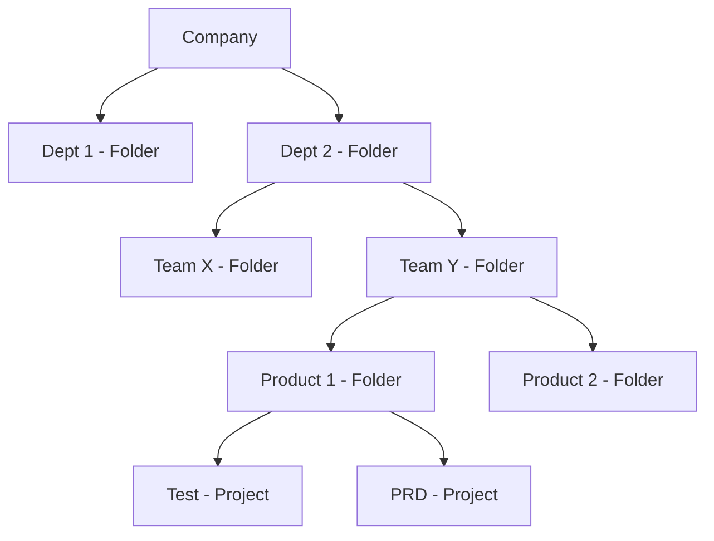

# Preparing for Your Associate Cloud Engineer Journey
This course helps you structure your preparation for the Associate Cloud Engineer exam. You will learn about the Google Cloud domains covered by the exam and how to create a study plan to improve your domain knowledge.

## Introduction
**What is the role of an Associate Cloud Engineer?**

An Associate Cloud Engineer deploys and secures applications and infrastructure, monitors operations of multiple projects, and maintains enterprise solutions to ensure that they meet target performance metrics. This individual has experience working with public clouds and on-premises solutions. They are able to use Google Cloud console and the CLI to perform common platform-based tasks to maintain and scale one or more deployed solutions that leverage Google-managed or self-managed services on GCP.

**Why become a Google Cloud Certified Associate Cloud Engineer?**
- industry recognition;
- validates your technical expertise;
- starting point to take your career to the next level.

The associate cloud engineer certification is valuable on its own, and can also be used as a starting point on the path to professional certification.

**What is the difference between associate and professional certification?**

Associate Cloud Engineering:
1. Technical requirements: Build, Deploy and Manage

Professional Level Certification:
1. Business requirements: Design, Plan, Ensure feasibility, Optimize
1. Technical requirements: Build, Deploy and Manage

## Setting Up a Cloud Solution Environment
Module 1 - Implementing the basic cloud infrastructure for the organization:
1. Setting up cloud projects and accounts;
    - Establishing a resource hierarchy
    - Implemeting organizational policies to the resource hierarchy
    - Managing projects and quotas
    - Managing users and groups in Cloud Identity (manually and automated)
    - Applying access management
    - Enabling APIs within projects
    - Provisioning and setting up products in GC Observability
1. Managing billing configuration
    - Creating one or more billing accounts
    - Linking projects to a billing account
    - Establishing billing budgets and alerts
    - Setting up billing exports
1. Installing and configuring the CLI

Setting up products in Google Cloud Observability: provide metrics and logging services for all services, resources and projects.

To monitor metrics from multiple project, you set up project scoping. If Cymbal Superstore’s Operations department decides to monitor metrics across all three supply chain projects in the staging environment project, you will set staging as a scoping project and then add dev and production as monitored projects.

Interacting with Google Cloud:
- **Web user interface**: Google Cloud Console
- **Command-line interface**: Cloud SDK  and Cloud Shell
- **iOS and Android**: Cloud Mobile app
- **Custom applications**: REST-based API

### Resource Hierarchy
1. Organization sits at the top of the Google Cloud resource hierarchy
1. Folders are optional and come between organization and projects
1. Projects
1. Resources

When you give a user, group, or service account a role on a specific element of the resource hierarchy, the resulting policy applies to the element you chose, as well as to elements below it in the hierarchy.

### Managing users and groups in Cloud Identity (manually and automated)
1. Users should be added to groups **and groups assigned roles** to simplify permissions management.
    - Avoid to assign roles to an individual user
1. Best practice is to manage role assignment by groups not by individual users.
1. You assign members to roles through an IAM policy. Roles are combinations of permissions needed for a role.
1. Members can be a Google account, a service account, a Google group, a Google Workspace domain, a cloud Identity domain, all authenticated users, and all users.
1. A service account is an account for an application instead of an end user.

### Applying access management
IAM (Identity and Access Management):
1. Who
1. Can do what
1. on which resource

### Ways to Interact with the services
Cloud SDK:
- is a set of tools that you can use to manage resources and applications hosted on Google Cloud.
- provides a local CLI environment
- (gcloud, gcloud storage, and bq)

Cloud Shell:
- It provides a cloud-based CLI environment
- is a Debian-based virtual machine with a persistent 5-GB home directory
- Built-in authorization for access to projects and resources

The gcloud tool lets you manage development workflow and Google Cloud resources
in a terminal window. You can run gcloud commands by installing the Cloud SDK, which includes the cloud tool. You use it by opening a terminal window on your own computer.

Client libraries are also provided by the Cloud SDK. They provide access to API’s for access to services, called application API’s, and Admin API’s which allow you to automate resource management tasks.

### Documentation to review:
Setting up cloud projects and accounts
- [IAM Overview](!https://cloud.google.com/iam/docs/overview)
- [Cloud Platform Resource hierarchy](!https://cloud.google.com/resource-manager/docs/cloud-platform-resource-hierarchy)
- [Understanding roles](!https://cloud.google.com/iam/docs/understanding-roles)

Managing billing configuration
- [Managing billing account](!https://cloud.google.com/billing/docs/how-to/manage-billing-account)
- [Budgets](!https://cloud.google.com/billing/docs/how-to/budgets)

Installing and configuring the command line interface (CLI), specifically the Cloud SDK
- [Ways to Interact with the services](!https://cloud.google.com/docs/overview#ways_to_interact_with_the_services)
- [Initializing with SDK](!https://cloud.google.com/sdk/docs/initializing)
- [Managing gcloud CLI components](!https://cloud.google.com/sdk/docs/components)
- [Gcloud Reference](!https://cloud.google.com/sdk/gcloud/reference)
- [BQ Guide](!https://cloud.google.com/bigquery/docs/bq-command-line-tool)
- [Gcloud Storage Reference](!https://cloud.google.com/sdk/gcloud/reference/storage)

## Planning and Configuring a Cloud Solution
After implementing the basic cloud infrastructure (Previous section), the next steps are:
- Planning and estimating Google Cloud princing using the Pricing Calculator
- Planning and configuring compute resources
- Planning and configuring data storage options
- Planning and configuring nesources

There are some common questions to ask while you are analyzing the data needs.
1. Are your data processing needs transactional or analytical?
1. Do you need to query your data in a relational way?
1. Do you want large groups of related data to be returned through 
a non-relational get operation?
1. Does it require access to the internet, or do you just need to provide connectivity to internal components on your private network?
1. Are you going to configure the connectivity of multiple application servers by load balancing incoming traffic across them?
1. How are you going to protect your app against network or system outages?

### Planning and estimating Google Cloud princing using the Pricing Calculator
The Pricing Calculator is a multi-section form that lets you estimate the costs of different cloud services based on how you are going to use and configure them.

Obs:
- *Egress is the amount of data read from the bucket and is also chargeable.*

### Planning and configuring compute resources
A cloud architect will typically design a cloud solution. As an Associate Cloud Engineer, it’s important for you to be able to plan and configure compute resources to align with Google recommended practices. That means you should be comfortable with the different compute options available in Google Cloud and when to use each one.

Considerations include:
- Selecting appropriate compute choices for a given workload
    - (e.g., Compute Engine, Google Kubernetes Engine, Cloud Run, Cloud Functions)
- Using preemptible VMs and custom machine types as appropriate

There are five distinct ways to interact with compute resources in Google Cloud. They can be divided into server-based services (IaaS), where manage and pay for infrastructure, and serverless options (PaaS), where you just pay for execution time. The options are:
- Infraestructure as a Service (IaaS):
    - Compute Engine
    - GKE - Google Kubernetes Engine
- Platform as a Service (PaaS):
    - App Engine
    - Cloud Run
    - Cloud Functions

PaaS options, you focus on code and Google manages the underlying hardware and OSs for you.

When you need to use:
- Compute Engine: 
    - Complete controle,
    - Ability to make OS level changes, 
    - To be able to move to the cloud without rewriting the code
    - To use custom VM images
- GKE
    - No dependencies on a specific OS
    - Increased velocity and operability
    - To manage containers in production
- App Engine
    - To just focus on writting code
    - Developer velocity
    - Minimize operational overhead
- Cloud Run
    - Scales to meet demand
    - Pay for what you use
    - Supports API endpoints
- Cloud Functions
    - For event-driver workloads
    - Scales to meet demand
    - Minimal configuration

Typical Uses Cases:
- Compute Engine: 
    - Any workload requiring a specific OS or configuration
    - On premises software that you want to run in the cloud
- GKE
    - Containerized workloads
    - Cloud-native distributed systems
    - Hybrid applications
- App Engine
    - Web sites
    - Apps
    - Gaming back ends
    - IoT applications
- Cloud Run
    - Web frameworks
    - Microservices
- Cloud Functions
    - Statiscal analysis
    - Image trumbnail generation
    - Post a comment to a Slack channel after a GitHub commit

App Engine has two environments: standard and flexible. Standard provides a sandbox environment and totally abstracts the infrastructure for you. The flexible environment gives you more choices for deploying your app. It supports more languages, supports different runtimes, and lets you load dependencies you need in the underlying architecture.

Cloud Run, which is also serverless, enables you to run stateless containers via web requests and Google Cloud service events. Cloud Run operates using Knative, an open-source, Kubernetes-based platform. It builds, deploys, and manages modern serverless workloads. Cloud Run gives you the choice of running your containers either fully-managed or in your own GKE cluster.

### Planning and configuring data storage options
Along with compute resources, an Associate Cloud Engineer needs to be able to plan and configure data storage in Google Cloud. that requires understanding of the different product choices (Cloud SQL, BigQuery, Firestore, Spanner, Bigtable) and storage options (Zonal persistent disk, regional balanced persistent disk, standard, nearline, coldline, archive), and how to make recommended choices for a given use case.

Differentiate between relational databases and data warehouses:
- relational databases can be transactional, while data warehouses are analytical and based on historical data.

Product choices:
- Cloud SQL: It is is optimized for **transactional** reads and writes. It is a managed version of databases you can implement on-premises,
- BigQuery: It is Google Cloud’s implementation of a modern data warehouse. BigQuery analyzes historical data and uses a SQL query engine. It does have a native storage format but can also query external data where it resides. *Keep in mind its native storage format is not a good solution for a backend store for an application.*
- Firestore: It is a NoSQL **document database** used to define entities with attributes. It is not a good choice for the analysis of historical data.
- Spanner: It is an SQL-compatible relational database, but it is not built for analyzing historical data. Spanner is horizontally scalable and globally available.
- Bigtable: It is based on column families where rows of data are referenced by a key that combines commonly queried columns. Related columns can additionally be organized into column families such as username and address.

Comparing Data Storage and Database Options
1. Warehouse
    - Product: BigQuery
        - Good for: Analytics, dashboards
1. Relational
    - Product: Cloud SQL
        - Good for: transactional, web frameworks (such as CMS, eCommerce, customer orders, user credentials)
    - Product: Spanner
        - Good for: **global** transactions, automatic multi-site replication, failover. Large-scale database applications (> 2TiB)
1. Non-relational:
    - Product: Firestone
        - Good for: Hierarchical, mobile, web, storing, syncing, and querying data.
    - Product: BigTable
        - Good for: Heavy read/write, events, flat data, **analytical data**
1. Object:
    - Product: Cloud Storage
        - Good for: Binary or object data. Such as: Images, media serving.

Storage classes:
- **Archive storage** is the best choice for data that you plan to access less than once a year.
    - Use when: Data archiving, online backup, and disaster recovery.
- **Coldline** is good for storing data accessed only every 90 days.
    - Use when: Very infrequently accessed data - ie, once a year. Typically this is for disaster
recovery, or for financial data that has to be kept for a certain length of time to meet regulatory needs.
- **Nearline** is good for storing data accessed only every 30 days.
    - Use when: deal for back-up and serving long-tail multimedia content.
- **Standard storage** is best for data that is frequently accessed ("hot" data) and/or stored for only brief periods of time. In addition, co-locating your resources by selecting the regional option maximizes the performance for data-intensive computations and can reduce network charges.
    - Use when: "hot" data

OLTP and OLAP:
Two common workloads required in a modern business environment are transactional workloads and analytical workloads.

Transactional workloads are optimized for more writes and updates than reads. Transactional means either all parts of an update happen or none of them do. For example, think of the importance of making sure deposits and withdrawals are recorded in a financial system. Both of these are part of one transaction. Relational database services used to support transactional systems in Google Cloud include Cloud SQL and Spanner.

The other type of workload is analytical. It is based on querying historical data that
doesn’t change often, and is optimized for writes. BigQuery is a good option for this kind of workload.

### Planning and configuring network resources

Meu ponto fraco

Together with compute and storage decisions, an associate cloud architect should be able to plan and configure network resources in Google Cloud - including load balancing, resource locations, and Cloud DNS. Tasks include:
- Differentiating load balancing options. E.g: load balancing options to the appropriate TCP layer
- Identifying resource locations in a network for availability. E.g.: List regional load balancing options and when to use each one: regional, regional internal (for use inside a VPC).
- Configuring Cloud DNS

#### Differentiating load balancing options
An important consideration when designing an application accessed by end users is load balancing.

Load balancing takes user requests and distributes them across multiple instances of your application. This helps to keep your application from experiencing performance issues if there is a spike in user activity.

Load balancing options available in Google Cloud can be **divided into** those that operate at **layer 7 (application)** of the OSI model and those that operate at **layer 4** of the stack.
The http(s) and file transfer protocol (ftp) load balancers live at Layer 7 of the OSI model.

Layer 4 of the OSI model encapsulates host-to-host communication in both the Transport and Network levels.  TCP/UDP, SSL and network load balancers reside at Layer 4 of the OSI model.

Google cloud offers both internal and external load balancers.
- The external load balancers include https, SSL, and TCP load balancers.
- Internal load balancers include TCP/UDP, http(s), and network pass-through load balancers.

In Google Cloud, load balancers can be be proxied or pass-through.
- Proxied load balancers terminate connections and proxy them to new connections internally.
- Pass-through load balancers pass the connections directly to the backends.

Load balancing options:
- Global HTTP(S)
    - Layer 7 load balancing based on load. 
    - Can route different URLs to different backends.
    - Traffic type: HTTP or HTTPS
    - Global, IPv4, IPv6
    - External ports: HTTP on 80 or 8080; HTTPs on 443.
- Global SSL Proxy
    - Layer 4 load balancing of non-HTTPS SSL traffic based on load.
    - Supported on specific port numbers.
    - Traffic type: TCP with SSL offload
    - Global, IPv4, IPv6
- Global TCP Proxy
    - Layer 4 load balancing of non-SSL TCP traffic
    - Supported on specific port numbers
    - Traffic type: TCP without SSL offload (Does not preserve client IP address)
    - Global, IPv4, IPv6
- Regional
    - Load balancing of any traffic (TCP, UDP)
    - Support on **any** port number
- Regional internal
    - Load balancing of traffic inside a VPC
    - User for the internal tiers of multi-tier applications
    - It can be TCP/UDP or HTTP/HTTPS traffic type

When load balancing in a particular region, external connectivity to your front ends can happen through an external http(s) load balancer with the proper forwarding rules and the standard networking tier. For connectivity internal to your defined vpc network, you should use the internal https and internal TCP/UDP load balancing options.

Exercises notes:
- **Premium** external https load balancer is **global** and more expensive;
- https load balancer is proxied, not pass-through;
- TCP/UDP is a pass-through balancer;
- **Premium** tier SSL is **global** and is not the proper solution between web and backend within a region.
- SSL load balancer is not a good solution for web front ends. For a web frontend, you should use an HTTP/S load balancer (layer 7) whenever possible.
- A standard tier proxied external load balancer is effectively a regional resource.
- A regional internal load balancer doesn’t require external IPs and is more secure.

### Documentation to review:
Planning and estimating Google Cloud princing using the Pricing Calculator
- [Choosing the Right Compute option in GCP](!https://cloud.google.com/blog/products/compute/choosing-the-right-compute-option-in-gcp-a-decision-tree)

Planning and configuring compute resources
- [Resource hosting options](!https://cloud.google.com/hosting-options)
- [Compute Engine overview](!https://cloud.google.com/compute/docs/overview)
- [Choosing a compute option](!https://cloud.google.com/docs/choosing-a-compute-option)

Planning and configuring data storage options
- [Google Cloud online storage products](!https://cloud.google.com/products/storage?hl=en)
- [Google Cloud Storage Classes](!https://cloud.google.com/storage/docs/storage-classes)

Planning and configuring network resources
- [Cloud Load Balancing overview](!https://cloud.google.com/load-balancing/docs/load-balancing-overview)

## Deploying and Implementing a Cloud Solution
Deploying and implementing:
- Compute Engine resources
- GKE resources
- Cloud Run and Cloud Functions resources
- Data solutions
- Networking resources
- Cloud Marketplace
- Implementing resources via infrastructure as code

Understanding availability, concurrency, connectivity and access options for these services are keys to success as you deploy them to support your needs.

### Compute Engine
Deploying Compute Engine resources can include a range of tasks such as:
- Lauching compute instances using Cloud Console and Cloud SDK;
- Creating identical managed groups of instances based on an image template;
- Generating/uploading a custom SSH key for instances;
- Installing and configuring the Cloud Monitoring and Logging Agent. It allows to track performance and make changes when needed;
- Assessing compute quotas and requesting increases.

Compute Engine allows you to pick the amount of **memory and CPU** from predefined machine types. Machine types are divided into:
- standard;
- high memory;
- high cpu;
- memory-optimized;
- compute-optimized;
- shared-core categories.
- Custom.

If you need **GPU** support for a compute-heavy workload, you can choose to attach GPUs to certain machine types. You can only use GPUs with general-purpose N1 VMs or accelerator-optimized A2 VMs. Availability of these machine types varies by zone, so make sure you pick a zone that has GPU capability.

**Storage options** for your instances include:
- regional persistent disks;
- zonal persistent disks;
- and local SSD.

Regional persistent disks share replicas of the physical disks across two zones, so
you are protected from a single zone outage. Each persistent disk references data distributed across several physical disks.

**Disk types** you can attach to your virtual machine include:
- standard (HDD);
- SSD;
- or local SSD.

Balanced SSD gives you higher I/O than standard HDD, but less cost and I/O than fully capable SSD disks. Local SDDs provide a very high I/O since they are physically connected to the server your VM is running on.

When you create a virtual machine instance in the console it uses balanced SSD, while when you create one via a gcloud command, it uses standard HDD.

Summary of disk options:
- Persistent disk HDD:
    - Data redundancy, Encryption at rest, Snapshotting, Bootable
    - Use case: General, bulk file storage
- Persistent disk SSD
    - Data redundancy, Encryption at rest, Snapshotting, Bootable
    - Use case: Very random IOPS
- Local SSD disk:
    - Encryption at rest.
    - Use case: High IOPS and low latency.
- RAM disk:
    - Use case: low latency and risk of data loss.

The **Managed instance groups (MIGs)** can be used to deploy identical instances based on instance template. The instance group can be resized and it is typically used with autoscaler. Finally, a Manager ensures all instances are running.

A Managed Instance Groups ensures availability by keeping VM instances running. If a VM fails or stops, the MIG recreates it based on the instance template. You can make your MIG health checks application-based, which looks for an expected response from your application. The MIG will automatically recreate VMs that are not responding correctly. Another availability feature is spreading load across multiple zones using a regional MIG. Finally, you can use a load balancer to evenly distribute traffic across all instances in the group.

When it comes time to update software, automated updates lets you define how you will upgrade the instances in a group. You can specify how many resources to use and how many instances can be unavailable at the same time. Available update scenarios include rolling updates and canary updates. Rolling updates define how you want all instances eventually upgraded to the new template. Canary updates let you specify a certain number of instances to upgrade for testing purposes.

Question 1: Migrate the MySQL database with User-Defined Functions (UDFs) in the most timely and economical way. Notes about the question below.
- Find a MySQL machine image in Cloud Marketplace meets the requirements but is not the most timely way to implement the solution because it requires additional manual configuration;
- Implementing a database instance using Cloud SQL is incorrect because it does not support UDFs.
- Use gcloud to implement a Compute Engine instance with an E2-standard type is incorrect because E2 is a cost-optimized Machine type. 
- Configure a Compute Engine with an N2 Machine type, install MySQL and restore the data to the new instance is correct because N2 is balanced machine type, which is recommended for medium-large databases.

Question 2: Updating the OS of the instances in an automated way using minimal resources. Notes about the question below.
- Create a new instance template, then click Update VMs. Set the update type to PROACTIVE. Click Start. It is the right alternative because this institutes a rolling update automatically, which minimizes resources as requested.
- Set update type to Opportunistic is incorrect because updates are not interactive.
- Set max surge to 5 is incorrect because it creates 5 new machines at a time and it does not use minimal resources.

### Google Kubernetes Engine resources
As an Associate Cloud Engineer, you should be comfortable with the Kubernetes CLI, kubectl, and the steps to deploy clusters and applications to GKE. You’ll also need to configure monitoring and logging in GKE. In other words, the tasks include:
- Installing and configuring the command line interface (CLI) for Kubernetes (kubectl);
- Deploying a Google Kubernetes Engine cluster with different configurations including AutoPilot, regional clusters, private clusters, etc.;
- Deploying a containerized application to Google Kubernetes Engine;
- Configuring Google Kubernetes Engine monitoring and logging.

Basic concepts:
- A cluster deploys containers on a set of nodes.
- Nodes are VMs (Compute Engine instances).

GKE has to modes to choose from: **autopilot mode and standard mode**. Autopilot is fully-provisioned and managed. You are charged according to the resources pods use as you deploy and replicate them based on the pod spec. Standard mode provides you flexibility to define and manage the cluster structure yourself.

In a GKE cluster, availability deals with both the control plane and the distribution of your nodes. A zonal cluster has a single control plane in a single zone. You can distribute the nodes of a zonal cluster across multiple zones, providing node availability in case of a node outage. A regional cluster, on the other hand, has multiple replicas of the control plane in multiple zones with a given region. Nodes in a regional cluster are replicated across three zones, though you can change this behavior as you add new node pools.

Routing between pods (**Network routing**) in GKE can be accomplished using alias IPs or Google Cloud Routes. The first option is also known as a VPC-native cluster, and the second one is called a routes-based cluster.

**Network Isolation**: Public GKE networks let you set up routing from public networks toyour cluster. Private networks use internal addresses for pods and nodes and are isolated from public networks.

Question 3: A need to build a new cloud app using a small Kubernetes cluster for the pilot that should only be available to the development team and does not need to be highly available. Additionally, the developers also need the ability to change the cluster architecture. Notes about the question below.
- The correct ansewer: Implement a private standard zonal cluster in us-central1-a with a default pool and an Ubuntu image.
- Standard clusters can be zonal and the default pool provides nodes used by the cluster.
- Autopilot clusters are regional. They are managed at the pod level. Consequently, it doesn’t support Ubuntu image types.
- The container-optimized image that supports autopilot type does not support custom packages.

### Documentation to review:
Deploying and implementing Compute Engine resources
- [Compute Engine Documentation](!https://cloud.google.com/compute/docs/)
- [Basic scenarios for creating managed instance groups](!https://cloud.google.com/compute/docs/instance-groups/creating-groups-of-managed-instances)

Deploying and implementing Google Kubernetes Engine resources
- [Types of Clusters](!https://cloud.google.com/kubernetes-engine/docs/concepts/types-of-clusters)

## Ensuring Successful Operation of a Cloud Solution

## Configuring Access and Security

