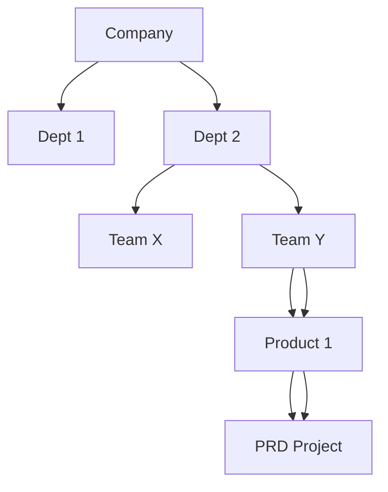

# Preparing for Your Associate Cloud Engineer Journey
This course helps you structure your preparation for the Associate Cloud Engineer exam. You will learn about the Google Cloud domains covered by the exam and how to create a study plan to improve your domain knowledge.

## Introduction
**What is the role of an Associate Cloud Engineer?**

An Associate Cloud Engineer deploys and secures applications and infrastructure, monitors operations of multiple projects, and maintains enterprise solutions to ensure that they meet target performance metrics. This individual has experience working with public clouds and on-premises solutions. They are able to use Google Cloud console and the CLI to perform common platform-based tasks to maintain and scale one or more deployed solutions that leverage Google-managed or self-managed services on GCP.

**Why become a Google Cloud Certified Associate Cloud Engineer?**
- industry recognition;
- validates your technical expertise;
- starting point to take your career to the next level.

The associate cloud engineer certification is valuable on its own, and can also be used as a starting point on the path to professional certification.

**What is the difference between associate and professional certification?**

Associate Cloud Engineering:
1. Technical requirements: Build, Deploy and Manage

Professional Level Certification:
1. Business requirements: Design, Plan, Ensure feasibility, Optimize
1. Technical requirements: Build, Deploy and Manage

## Setting Up a Cloud Solution Environment
Module 1 - Implementing the basic cloud infrastructure for the organization:
1. Setting up cloud projects and accounts;
    - Establishing a resource hierarchy
    - Implemeting organizational policies to the resource hierarchy
    - Managing projects and quotas
    - Managing users and groups in Cloud Identity (manually and automated)
    - Applying access management
    - Enabling APIs within projects
    - Provisioning and setting up products in GC Observability
1. Managing billing configuration
1. Installing and configuring the CLI

Setting up products in Google Cloud Observability: provide metrics and logging services for all services, resources and projects.

To monitor metrics from multiple project, you set up project scoping. If Cymbal Superstore’s Operations department decides to monitor metrics across all three supply chain projects in the staging environment project, you will set staging as a scoping project and then add dev and production as monitored projects.

Interacting with Google Cloud:
- **Web user interface**: Google Cloud Console
- **Command-line interface**: Cloud SDK and Cloud Shell
- **iOS and Android**: Cloud Mobile app
- **Custom applications**: REST-based API

### Resource Hierarchy
1. Organization sits at the top of the Google Cloud resource hierarchy
1. Folders are optional and come between organization and projects
1. Projects
1. Resources

When you give a user, group, or service account a role on a specific element of the resource hierarchy, the resulting policy applies to the element you chose, as well as to elements below it in the hierarchy.

### Managing users and groups in Cloud Identity (manually and automated)
1. Users should be added to groups **and groups assigned roles** to simplify permissions management.
    - Avoid to assign roles to an individual user
1. Best practice is to manage role assignment by groups not by individual users.
1. You assign members to roles through an IAM policy. Roles are combinations of permissions needed for a role.
1. Members can be a Google account, a service account, a Google group, a Google Workspace domain, a cloud Identity domain, all authenticated users, and all users.
1. A service account is an account for an application instead of an end user.

### Applying access management
IAM (Identity and Access Management):
1. Who
1. Can do what
1. on which resource

### Documentation to review:
- [IAM Overview](!https://cloud.google.com/iam/docs/overview)
- [Cloud Platform Resource hierarchy](!https://cloud.google.com/resource-manager/docs/cloud-platform-resource-hierarchy)

## Planning and Configuring a Cloud Solution

## Deploying and Implementing a Cloud Solution

## Ensuring Successful Operation of a Cloud Solution

## Configuring Access and Security

